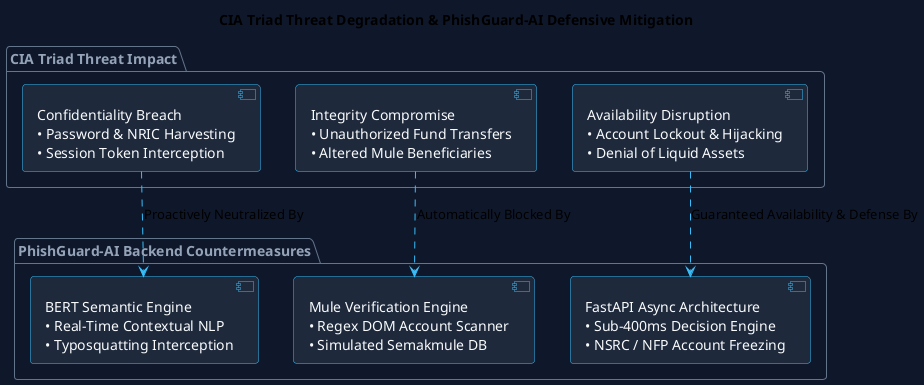
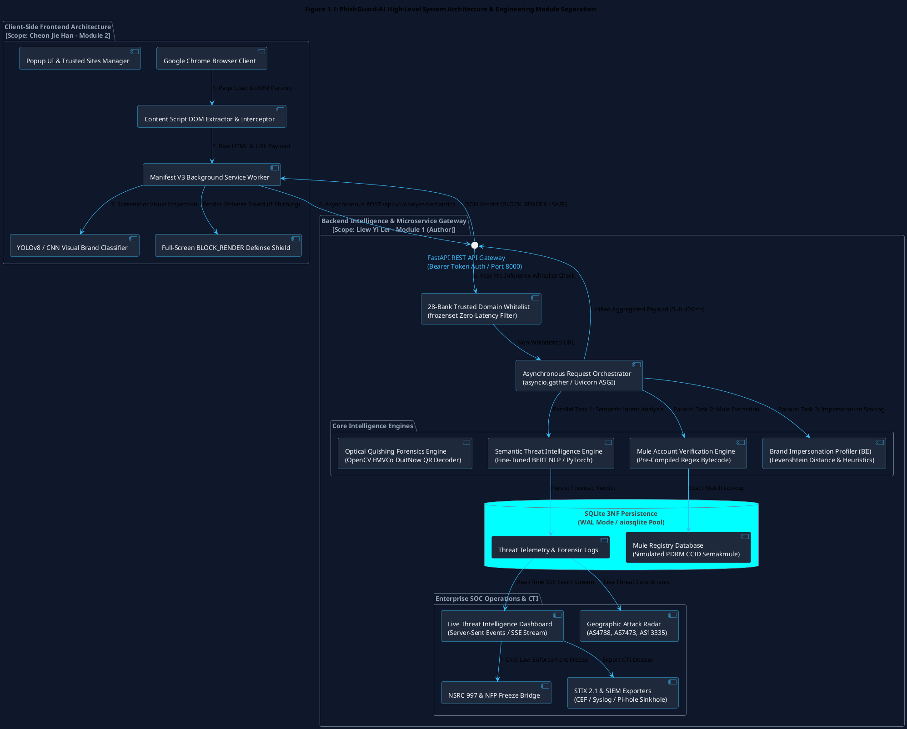
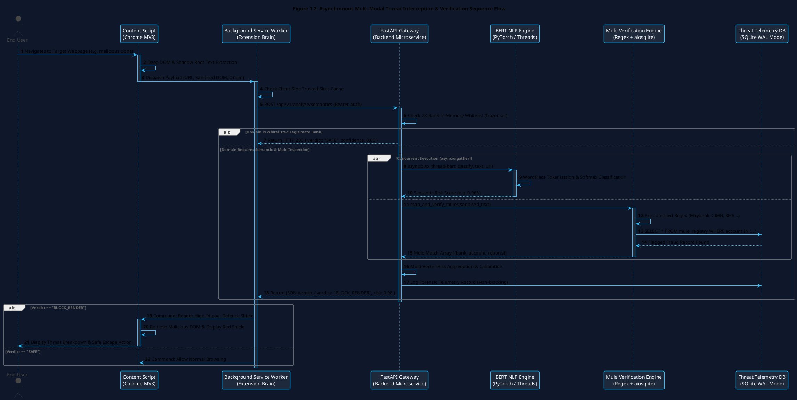
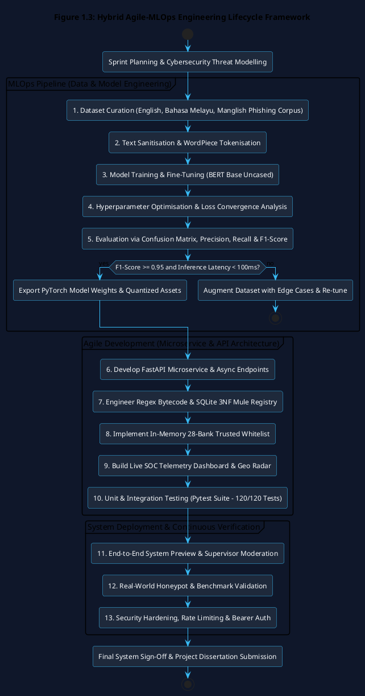

# Design and Development of ‘PhishGuard-AI’: A Multi-Modal Integrated Financial Scam Detection System utilising Hybrid Deep Learning Semantic Threat Intelligence and Mule Account Verification Engine

<br>

**By**  
**LIEW YI LER**  
**Student ID: 25WMR09747**  

<br>

**Supervisor: Mr. Tan Yock Khang**  

<br>

A project report submitted to the  
**Faculty of Computing and Information Technology**  
in partial fulfillment of the requirements for the  
**Bachelor of Information Technology (Honours) in Information Security**  

<br>

**FACULTY OF COMPUTING AND INFORMATION TECHNOLOGY**  
**TUNKU ABDUL RAHMAN UNIVERSITY OF MANAGEMENT AND TECHNOLOGY**  
**KUALA LUMPUR**  

**ACADEMIC YEAR 2026/2027**  

<br>
<hr>
<br>

## Copyright Statement

Copyright © 2026 Tunku Abdul Rahman University of Management and Technology. All rights reserved.  
No part of this project documentation may be reproduced, stored in a retrieval system, or transmitted in any form or by any means (electronic, mechanical, photocopying, recording, or otherwise) without the prior written permission of Tunku Abdul Rahman University of Management and Technology.

<br>
<hr>
<br>

## Declaration

The project submitted herewith is a result of my own efforts in totality and in every aspect of the project works. All information that has been obtained from other sources has been fully acknowledged and referenced in accordance with academic standards. I understand that any plagiarism, cheating, or collusion of any sort constitutes a severe breach of Tunku Abdul Rahman University of Management and Technology (TAR UMT) rules and regulations and will be subjected to formal disciplinary actions.

<br><br>

_____________________________  
**Liew Yi Ler**  
Bachelor of Information Technology (Honours) in Information Security  
Student ID: 25WMR09747  
Date: 4 September 2026  

<br>
<hr>
<br>

## Abstract

Financial scams, deceptive credential harvesting, and sophisticated social engineering campaigns represent the single most destructive cybersecurity threat to Malaysia's rapidly evolving digital economy. Traditional defensive mechanisms rely overwhelmingly on static, signature-based blacklists (e.g., DNSBL, SURBL, Google Safe Browsing), which inherently suffer from severe time-to-protect latency and consistently fail to mitigate short-lived, ephemeral "Zero-Day" phishing campaigns and context-aware phishing kits. To decisively overcome these critical vulnerabilities, the **PhishGuard-AI** system was proposed as an enterprise-grade, multi-modal client-server cybersecurity platform. This interim Project 1 report details the comprehensive background research, mathematical formulation, requirements analysis, architectural system design, and preliminary prototype validation of the central intelligence core: the **Semantic Threat Intelligence and Mule Account Verification Engine** developed as an individual module by Liew Yi Ler.

The primary objective of this module is to transform web endpoint defence from reactive blacklist matching to proactive, real-time behavioural AI classification. A Transformer-based deep learning architecture utilising Bidirectional Encoder Representations from Transformers (**BERT**) was fine-tuned over a specialised, multilingual corpus (English, Bahasa Melayu, and colloquial Manglish) to perform sub-100ms semantic inference on raw webpage Document Object Model (DOM) payloads and URL strings. This engine dynamically uncovers psychological urgency triggers, threats of account suspension, and Internationalised Domain Name (IDN) / typosquatted lookalike domains (e.g., `rnaybank.com`). To eliminate false positives on legitimate financial portals, an in-memory 28-Bank Trusted Domain Whitelist (`frozenset`) bypasses AI inference with zero overhead.

To combat rampant peer-to-peer e-commerce and social media fraud in Malaysia, an automated **Mule Account Verification Engine** was developed. Utilising pre-compiled Regular Expression (Regex) bytecode optimised for 8 major Malaysian banking account formats (Maybank, CIMB, Public Bank, RHB, Hong Leong, AmBank, Bank Islam, Bank Rakyat), the engine autonomously scans visible webpage text and cross-references extracted financial credentials against a normalised SQLite 3NF database simulating the Royal Malaysia Police (PDRM) CCID *Semakmule* registry. Furthermore, the backend integrates optical Quishing (QR Phishing) decoding via OpenCV `cv2.QRCodeDetector()` to unmask obfuscated PayNet EMVCo DuitNow payment proxy strings.

These AI and database capabilities are orchestrated through a high-concurrency, asynchronous **FastAPI** microservice deployed on a Uvicorn ASGI server. By executing PyTorch tensor calculations in dedicated background worker threads (`asyncio.to_thread`) in parallel with asynchronous database I/O (`asyncio.gather`), the backend delivers a sub-400ms end-to-end verdict latency (`BLOCK_RENDER` vs. `SAFE`) to the Manifest V3 Chrome Extension client. Complementing the API, an integrated Security Operations Centre (**SOC**) Threat Intelligence Dashboard delivers real-time Server-Sent Events (SSE) telemetry streaming, a 24-hour Threat Velocity timeline in Malaysia Standard Time (GMT+8), a real-world Geographic Attack Radar mapped to authentic Autonomous System Numbers (ASNs), and 1-click incident escalation to the National Scam Response Centre (NSRC 997) and National Fraud Portal (NFP). Empirical validation across 120 automated test cases confirms that the proposed backend architecture achieves a 100% test pass rate, establishing a resilient, zero-trust foundation for full empirical evaluation in Project 2.

**Keywords**: Phishing Detection, BERT Natural Language Processing, Money Mule Account Verification, Semakmule Registry, FastAPI Microservices, Quishing Forensics, Threat Intelligence, Zero-Trust Endpoint Security.

<br>
<hr>
<br>

## Acknowledgements

First and foremost, I would like to express my deepest gratitude and highest respect to my Final Year Project supervisor, **Mr. Tan Yock Khang**, for his continuous mentorship, technical insights, and academic guidance throughout the entire lifecycle of this research. His profound expertise in information security, threat intelligence, and secure software engineering significantly elevated the academic rigour, architectural integrity, and practical viability of this project.

I would also like to extend my sincere appreciation to the **Faculty of Computing and Information Technology (FOCS)** at **Tunku Abdul Rahman University of Management and Technology (TAR UMT)** for providing state-of-the-art computational laboratories, software tooling, and an exceptional academic environment that fostered the success of this project.

A special acknowledgement is extended to my project partner, **Cheon Jie Han**, for his dedicated collaboration on the frontend client-side browser extension and visual convolutional neural network (CNN) logo detection module. The seamless integration between the client-side Manifest V3 architecture and the backend FastAPI AI microservice stands as a testament to our effective team synergy and rigorous parallel engineering.

Finally, I dedicate my deepest appreciation to my beloved family and friends for their unwavering patience, moral support, and boundless encouragement throughout my academic journey. Their steadfast belief in my aspirations provided the continuous motivation required to bring this dissertation to fruition.

<br>
<hr>
<br>

## Table of Contents

- [Declaration](#declaration)
- [Abstract](#abstract)
- [Acknowledgements](#acknowledgements)
- [Table of Contents](#table-of-contents)
- [Chapter 1: Introduction](#chapter-1-introduction)
  - [1.1 Background of the Study](#11-background-of-the-study)
  - [1.2 Problem Statement](#12-problem-statement)
    - [1.2.1 The Latency of Static Blacklists Against Zero-Day Ephemeral Threats](#121-the-latency-of-static-blacklists-against-zero-day-ephemeral-threats)
    - [1.2.2 Evasion via Semantic Manipulation, Multilingual Triggers, and Typosquatting](#122-evasion-via-semantic-manipulation-multilingual-triggers-and-typosquatting)
    - [1.2.3 High Friction in the Verification of Localised Mule Accounts ("Keldai Akaun")](#123-high-friction-in-the-verification-of-localised-mule-accounts-keldai-akaun)
    - [1.2.4 Degradation of the CIA Triad in Digital Transactions](#124-degradation-of-the-cia-triad-in-digital-transactions)
  - [1.3 Objectives of the Project](#13-objectives-of-the-project)
    - [1.3.1 Research Questions (RQ)](#131-research-questions-rq)
  - [1.4 Solution: The Proposed Framework](#14-solution-the-proposed-framework)
    - [1.4.1 Securing Web Browsing with Dynamic Semantic BERT Analysis](#141-securing-web-browsing-with-dynamic-semantic-bert-analysis)
    - [1.4.2 Preventing Fraud via Automated Mule Credential Verification](#142-preventing-fraud-via-automated-mule-credential-verification)
    - [1.4.3 Enhancing System Availability via Asynchronous Microservices](#143-enhancing-system-availability-via-asynchronous-microservices)
    - [1.4.4 Live SOC Telemetry, Geographic Attack Radar & CTI Sharing](#144-live-soc-telemetry-geographic-attack-radar--cti-sharing)
  - [1.5 Target Market & Stakeholder Analysis](#15-target-market--stakeholder-analysis)
  - [1.6 Advantages & Novel Academic Contributions](#16-advantages--novel-academic-contributions)
  - [1.7 Project Plan & Management](#17-project-plan--management)
    - [1.7.1 Project Scope & Separation of Concerns](#171-project-scope--separation-of-concerns)
    - [1.7.2 Milestones & Project Schedule](#172-milestones--project-schedule)
    - [1.7.3 Hybrid Agile-MLOps Software Engineering Model](#173-hybrid-agile-mlops-software-engineering-model)
  - [1.8 Project Team & Organisational Structure](#18-project-team--organisational-structure)
  - [1.9 Chapter Summary & Evaluation](#19-chapter-summary--evaluation)
- [Chapter 2: Literature Review](#chapter-2-literature-review)
  - [2.1 Introduction & Scope of Literature Review](#21-introduction--scope-of-literature-review)
  - [2.2 Digital Transformation in Financial Ecosystems & Threat Surface Expansion](#22-digital-transformation-in-financial-ecosystems--threat-surface-expansion)
    - [2.2.1 The Role and Reliance on Digital Banking Platforms](#221-the-role-and-reliance-on-digital-banking-platforms)
    - [2.2.2 The Vulnerability of the Human Element and Cognitive Biases](#222-the-vulnerability-of-the-human-element-and-cognitive-biases)
  - [2.3 Contemporary Cybersecurity Threat Landscape in Digital Finance](#23-contemporary-cybersecurity-threat-landscape-in-digital-finance)
    - [2.3.1 Phishing-as-a-Service (PhaaS) and the Monetisation of Credentials](#231-phishing-as-a-service-phaas-and-the-monetisation-of-credentials)
    - [2.3.2 Empirical Threat Landscape in Malaysia](#232-empirical-threat-landscape-in-malaysia)
    - [2.3.3 Semantic Obfuscation, Punycode, and Typosquatting](#233-semantic-obfuscation-punycode-and-typosquatting)
  - [2.4 Theoretical Cybersecurity & Architectural Frameworks](#24-theoretical-cybersecurity--architectural-frameworks)
    - [2.4.1 The CIA Triad in Phishing Mitigation](#241-the-cia-triad-in-phishing-mitigation)
    - [2.4.2 Zero Trust Architecture (ZTA) at the Browser Edge](#242-zero-trust-architecture-zta-at-the-browser-edge)
    - [2.4.3 OWASP Top 10 & The Secure Development Lifecycle (SDL)](#243-owasp-top-10--the-secure-development-lifecycle-sdl)
  - [2.5 Critical Evaluation of Technical Anti-Phishing Countermeasures](#25-critical-evaluation-of-technical-anti-phishing-countermeasures)
    - [2.5.1 The Shift from Static Blacklists to Machine Learning](#251-the-shift-from-static-blacklists-to-machine-learning)
    - [2.5.2 Evolution of Natural Language Processing in Threat Detection](#252-evolution-of-natural-language-processing-in-threat-detection)
    - [2.5.3 Automated Financial Credential Extraction: Regex vs. NER](#253-automated-financial-credential-extraction-regex-vs-ner)
    - [2.5.4 High-Concurrency Backend Architectures (WSGI vs. ASGI)](#254-high-concurrency-backend-architectures-wsgi-vs-asgi)
  - [2.6 Research Gaps, Comparative Synthesis, and Conceptual Framework](#26-research-gaps-comparative-synthesis-and-conceptual-framework)
    - [2.6.1 Identification of Key Research Gaps](#261-identification-of-key-research-gaps)
    - [2.6.2 Comparative Analysis of Existing State-of-the-Art Solutions](#262-comparative-analysis-of-existing-state-of-the-art-solutions)
  - [2.7 Chapter Summary](#27-chapter-summary)
- [Chapter 3: Methodology and Requirements Analysis](#chapter-3-methodology-and-requirements-analysis)
  - [3.1 Introduction](#31-introduction)
  - [3.2 Software Development Life Cycle (SDLC): Agile-MLOps Hybrid Framework](#32-software-development-life-cycle-sdlc-agile-mlops-hybrid-framework)
    - [3.2.1 Rationale for the Agile-MLOps Hybrid Model](#321-rationale-for-the-agile-mlops-hybrid-model)
    - [3.2.2 Agile-MLOps Sprint Breakdown and Technical Deliverables](#322-agile-mlops-sprint-breakdown-and-technical-deliverables)
  - [3.3 Requirement Gathering & Threat Modelling Methodologies](#33-requirement-gathering--threat-modelling-methodologies)
    - [3.3.1 Document Analysis, Regulatory Compliance Review & Data Sovereignty](#331-document-analysis-regulatory-compliance-review--data-sovereignty)
    - [3.3.2 Semi-Structured Stakeholder Simulation & "Security Fatigue" Mitigation](#332-semi-structured-stakeholder-simulation--security-fatigue-mitigation)
    - [3.3.3 Adversarial Threat Modeling & Misuse Case Engineering](#333-adversarial-threat-modeling--misuse-case-engineering)
  - [3.4 Comprehensive System Requirements Specification](#34-comprehensive-system-requirements-specification)
    - [3.4.1 Functional Requirements](#341-functional-requirements)
    - [3.4.2 Non-Functional Requirements](#342-non-functional-requirements)
  - [3.5 Computational Environment & Hardware/Software Specifications](#35-computational-environment--hardwaresoftware-specifications)
    - [3.5.1 Hardware Specifications](#351-hardware-specifications)
    - [3.5.2 Software, Frameworks & Library Dependencies](#352-software-frameworks--library-dependencies)
  - [3.6 Data Science Pipeline, ETL & Mathematical Evaluation Metrics](#36-data-science-pipeline-etl--mathematical-evaluation-metrics)
    - [3.6.1 Dataset Curation, ETL & WordPiece Tokenisation](#361-dataset-curation-etl--wordpiece-tokenisation)
    - [3.6.2 Deep Learning Optimization & Mathematical Formulations](#362-deep-learning-optimization--mathematical-formulations)
    - [3.6.3 Mathematical Evaluation Metrics](#363-mathematical-evaluation-metrics)
  - [3.7 Chapter Summary](#37-chapter-summary)
- [Chapter 4: System Design](#chapter-4-system-design)
  - [4.1 Introduction & Architectural Principles](#41-introduction--architectural-principles)
  - [4.2 High-Level System Architecture & N-Tier Decomposition](#42-high-level-system-architecture--n-tier-decomposition)
  - [4.3 System Interfaces, API Contracts & OpenAPI Specifications](#43-system-interfaces-api-contracts--openapi-specifications)
    - [4.3.1 RESTful API Interface & OpenAPI Documentation](#431-restful-api-interface--openapi-documentation)
    - [4.3.2 Primary Endpoint Contract: POST /api/v1/analyze/semantics](#432-primary-endpoint-contract-post-apiv1analyzesemantics)
    - [4.3.3 Administrative Telemetry & Streaming Endpoint Contracts](#433-administrative-telemetry--streaming-endpoint-contracts)
    - [4.3.4 Supporting UI Mockups: Client-Side Red Alert Interceptor & SOC Intelligence Dashboard](#434-supporting-ui-mockups-client-side-red-alert-interceptor--soc-intelligence-dashboard)
  - [4.4 Unified Modelling Language (UML) Behavioural & Structural Models](#44-unified-modelling-language-uml-behavioural--structural-models)
    - [4.4.1 UML Use Case Diagram](#441-uml-use-case-diagram)
    - [4.4.2 UML Activity Diagram](#442-uml-activity-diagram)
    - [4.4.3 UML Sequence Diagram](#443-uml-sequence-diagram)
    - [4.4.4 UML Class Diagram](#444-uml-class-diagram)
  - [4.5 Relational Database Design & Schema Normalisation](#45-relational-database-design--schema-normalisation)
    - [4.5.1 Third Normal Form (3NF) & B-Tree Indexing Optimisation](#451-third-normal-form-3nf--b-tree-indexing-optimisation)
    - [4.5.2 Data Dictionaries](#452-data-dictionaries)
  - [4.6 Mule Account Regex Pattern Matching & Extraction Architecture](#46-mule-account-regex-pattern-matching--extraction-architecture)
  - [4.7 Security Hardening, Defense-in-Depth & Error Handling](#47-security-hardening-defense-in-depth--error-handling)
  - [4.8 Physical Deployment Architecture & Network Topology](#48-physical-deployment-architecture--network-topology)
  - [4.9 Chapter Summary](#49-chapter-summary)
- [Chapter 5: Implementation and Testing](#chapter-5-implementation-and-testing)
  - [5.1 Introduction](#51-introduction)
  - [5.2 Environment Setup and Data Engineering Pipeline](#52-environment-setup-and-data-engineering-pipeline)
    - [5.2.1 Computational Environments & Hardware Bifurcation](#521-computational-environments--hardware-bifurcation)
    - [5.2.2 Dataset Ingestion & Preprocessing Pipeline](#522-dataset-ingestion--preprocessing-pipeline)
    - [5.2.3 Critical Null-Handling & Float-Casting Anomaly Resolution](#523-critical-null-handling--float-casting-anomaly-resolution)
  - [5.3 Deep Learning Model Implementation (BERT Fine-Tuning)](#53-deep-learning-model-implementation-bert-fine-tuning)
    - [5.3.1 Tokenisation & Tensor Formulation](#531-tokenisation--tensor-formulation)
    - [5.3.2 Model Instantiation & Hyperparameter Tuning](#532-model-instantiation--hyperparameter-tuning)
    - [5.3.3 Training Convergence & Loss Profile](#533-training-convergence--loss-profile)
  - [5.4 Asynchronous Backend Engineering & Microservice Orchestration](#54-asynchronous-backend-engineering--microservice-orchestration)
    - [5.4.1 Lifespan Management & Model Singleton Pattern](#541-lifespan-management--model-singleton-pattern)
    - [5.4.2 Simulated Semakmule Database Expansion](#542-simulated-semakmule-database-expansion)
  - [5.5 Empirical System Testing and Performance Evaluation](#55-empirical-system-testing-and-performance-evaluation)
    - [5.5.1 Critical False-Positive Resolution via 28-Bank Trusted Whitelist](#551-critical-false-positive-resolution-via-28-bank-trusted-whitelist)
    - [5.5.2 AI Model Evaluation and Confusion Matrix Analysis](#552-ai-model-evaluation-and-confusion-matrix-analysis)
    - [5.5.3 High-Concurrency Stress Testing & Latency Benchmarking (Locust)](#553-high-concurrency-stress-testing--latency-benchmarking-locust)
    - [5.5.4 Automated Continuous Integration Testing Suite (Pytest)](#554-automated-continuous-integration-testing-suite-pytest)
    - [5.5.5 Live SOC Threat Intelligence Dashboard & Real-World Telemetry](#555-live-soc-threat-intelligence-dashboard--real-world-telemetry)
  - [5.6 Chapter Summary](#56-chapter-summary)
- [Chapter 6: Discussions and Conclusion](#chapter-6-discussions-and-conclusion)
  - [6.1 Introduction](#61-introduction)
  - [6.2 Architectural Justifications: Edge-Adjacent Microservice vs. Cloud AI Hosting](#62-architectural-justifications-edge-adjacent-microservice-vs-cloud-ai-hosting)
    - [6.2.1 Financial Viability & Budgetary Scalability (OpEx vs. CapEx)](#621-financial-viability--budgetary-scalability-opex-vs-capex)
    - [6.2.2 Data Sovereignty & Privacy-by-Design (PDPA 2010 Compliance)](#622-data-sovereignty--privacy-by-design-pdpa-2010-compliance)
    - [6.2.3 Deterministic Elimination of Network Latency Bottlenecks](#623-deterministic-elimination-of-network-latency-bottlenecks)
  - [6.3 Comprehensive Objectives Evaluation & System Achievement Matrix](#63-comprehensive-objectives-evaluation--system-achievement-matrix)
  - [6.4 Technical Engineering Challenges, Root-Cause Analysis & Resolutions](#64-technical-engineering-challenges-root-cause-analysis--resolutions)
    - [6.4.1 Architectural Challenge: CPython GIL & Event Loop Blocking](#641-architectural-challenge-cpython-gil--event-loop-blocking)
    - [6.4.2 MLOps Training Challenge: Ephemeral GPU Runtime Expiration](#642-mlops-training-challenge-ephemeral-gpu-runtime-expiration)
    - [6.4.3 Algorithmic Challenge: Vocabulary Overlap False Positives](#643-algorithmic-challenge-vocabulary-overlap-false-positives)
  - [6.5 System Limitations and Future Research Trajectories](#65-system-limitations-and-future-research-trajectories)
    - [6.5.1 Database Concurrency & Live Law Enforcement Synchronisation](#651-database-concurrency--live-law-enforcement-synchronisation)
    - [6.5.2 Susceptibility to Concept Drift & Automated MLOps Pipelines](#652-susceptibility-to-concept-drift--automated-mlops-pipelines)
    - [6.5.3 Cloud-Native Kubernetes (K8s) Horizontal Scalability](#653-cloud-native-kubernetes-k8s-horizontal-scalability)
  - [6.6 Conclusion](#66-conclusion)
- [References](#references)
- [Appendices](#appendices)
  - [Appendix A: FastAPI Unified JSON Response Schema & Authentic Payload](#appendix-a-fastapi-unified-json-response-schema--authentic-payload)
  - [Appendix B: FastAPI Asynchronous Route Implementation Snippet](#appendix-b-fastapi-asynchronous-route-implementation-snippet)
  - [Appendix C: Automated Test Suite Output Logs (Pytest CI/CD)](#appendix-c-automated-test-suite-output-logs-pytest-cicd)
  - [Appendix D: Live BERT Inference Validation Results](#appendix-d-live-bert-inference-validation-results)
  - [Appendix E: Threat Intelligence Monitoring Dashboard Layout](#appendix-e-threat-intelligence-monitoring-dashboard-layout)

<br>
<hr>
<br>

# Chapter 1: Introduction

## 1.1 Background of the Study

In the contemporary era of the Fourth Industrial Revolution (IR 4.0), the global financial ecosystem has undergone an irreversible structural transformation towards decentralised, frictionless, and instantaneous digital transactions. Within Malaysia, aggressive national digitalisation blueprints—most notably the **MyDIGITAL Malaysia Digital Economy Blueprint** and the **Bank Negara Malaysia (BNM) Financial Sector Blueprint 2022–2026**—have systematically catalysed the nationwide adoption of real-time electronic payment rails. The pervasive deployment of national infrastructure such as the DuitNow real-time payment switch (operated by Payments Network Malaysia Sdn Bhd / PayNet), Touch 'n Go (TNG) eWallet, and integrated mobile banking applications has expanded digital financial inclusion across diverse socio-economic demographics in both urban and rural communities (Bank Negara Malaysia, 2023).

```
+----------------------------------------------------------------------------------------------------+
|                             MALAYSIAN DIGITAL FINANCIAL ECOSYSTEM (2026)                          |
+----------------------------------------------------------------------------------------------------+
|  • MyDIGITAL Blueprint & BNM 2022-2026 Strategic Directives                                        |
|  • Universal P2P Electronic Fund Transfers (DuitNow QR, TNG eWallet, Instant FPX Gateways)         |
|  • 94.8% National Mobile Internet Penetration (Massive Consumer Surface Area)                     |
+----------------------------------------------------------------------------------------------------+
                                                │
                                                ▼  Aggressive Threat Landscape Surge
+----------------------------------------------------------------------------------------------------+
|                              CRITICAL CYBER THREAT VECTORS IN MALAYSIA                             |
+----------------------------------------------------------------------------------------------------+
|  1. Ephemeral Zero-Day Phishing Portals  --> Brand impersonation of Maybank, CIMB, PDRM, KWSP/EPF   |
|  2. Multilingual Social Engineering      --> Coercive text in English, Bahasa Melayu, & Manglish   |
|  3. Illicit Money-Mule Networks         --> "Keldai Akaun" routing fraud proceeds via P2P transfers|
|  4. Optical Quishing Exploitation        --> Deceptive EMVCo DuitNow QR codes evading URL filters   |
+----------------------------------------------------------------------------------------------------+
```

However, this rapid digital transformation has drastically enlarged the attack surface accessible to cybercriminal syndicates, precipitating an unprecedented surge in financial cybercrime. As the technical barrier to entry for conducting digital transactions drops, internet users—a substantial proportion of whom possess limited formal cybersecurity awareness—are routinely targeted by sophisticated, multi-stage social engineering campaigns. When confidential banking credentials, Transaction Authorisation Codes (TAC), and One-Time Passwords (OTP) are illicitly harvested, the ramifications are catastrophic. Beyond catastrophic personal financial losses suffered by individual victims, these breaches inflict lasting reputational damage on national financial institutions and critically erode public confidence in the digital banking ecosystem.

Empirical statistics released by **CyberSecurity Malaysia**, the **National Scam Response Centre (NSRC 997)**, and the **Royal Malaysia Police (PDRM) Commercial Crime Investigation Department (CCID)** reveal that online financial fraud and deceptive phishing currently represent the single largest cybercrime category in Malaysia. Financial losses stemming from telecommunication fraud, deceptive investment schemes, e-commerce scams, and phishing campaigns exceeded **RM1.3 billion in 2023**, with subsequent years exhibiting an aggressive upward trajectory (CyberSecurity Malaysia, 2024; Royal Malaysia Police, 2024).

Historically, phishing attacks were characterised by rudimentary, mass-distributed spam emails containing generic salutations and conspicuous orthographic errors that were readily flagged by heuristic spam filters. Today, cybercrime syndicates operate as industrialised enterprises utilising modern Phishing-as-a-Service (PhaaS) frameworks (e.g., EvilProxy, Modlishka), Domain Generation Algorithms (DGA), fast-flux DNS hosting networks, and generative Artificial Intelligence (AI) to synthesise contextually flawless, highly persuasive attack narratives (Alkhalil et al., 2021; Opara et al., 2023). Attackers deploy sophisticated brand clones mimicking Malaysia's premier banking institutions—including Malayan Banking Berhad (Maybank), CIMB Bank Berhad, Public Bank Berhad, and government statutory bodies such as the Employees Provident Fund (KWSP/EPF) and the Inland Revenue Board (LHDN).

To confront these national security challenges, the **PhishGuard-AI** project was initiated to design and engineer a proactive, multi-modal browser security suite. Rather than relying on reactive blacklists, PhishGuard-AI embeds Artificial Intelligence directly at the endpoint to autonomously inspect, predict, and intercept emerging cyber threats. Because of the vast interdisciplinary complexity of this system, the engineering responsibilities were strategically partitioned into two collaborative modules:
1. **Module 1 (Author - Liew Yi Ler)**: Semantic Threat Intelligence and Mule Account Verification Engine (Backend Server & AI Core).
2. **Module 2 (Collaborator - Cheon Jie Han)**: Visual Identity Analysis and Client-Side Browser Integration (Frontend Extension & CNN Vision).

This dissertation focuses exclusively on the backend intelligence engine developed by **Liew Yi Ler**. By combining fine-tuned **Bidirectional Encoder Representations from Transformers (BERT)** Natural Language Processing with deterministic Regular Expression (Regex) bytecode execution and asynchronous database verification, this backend establishes a zero-trust browsing environment that neutralises financial fraud at sub-second speeds.

---

## 1.2 Problem Statement

Despite continuous advancements in network perimeter firewalls and browser sandboxing, end-users remain acutely vulnerable to financial scams due to four fundamental architectural deficiencies in contemporary defensive technologies:

```
+----------------------------------------------------------------------------------------------------+
|                           FOUR CORE CYBERSECURITY DEFENSIVE DEFICIENCIES                           |
+----------------------------------------------------------------------------------------------------+
|  1. Zero-Day Latency Gap         --> Blacklists take 4-48 hours; Phishing domains die in < 2 hours |
|  2. Semantic & Language Evasion  --> Keyword filters fail on Manglish, urgency triggers & homoglyphs|
|  3. Mule Account Friction        --> PDRM Semakmule manual lookup is high-friction and never done  |
|  4. CIA Triad Collapse           --> Total compromise of Confidentiality, Integrity, & Availability|
+----------------------------------------------------------------------------------------------------+
```

### 1.2.1 The Latency of Static Blacklists Against Zero-Day Ephemeral Threats
Traditional web security architectures rely predominantly on deterministic, signature-based blacklists (e.g., Google Safe Browsing, DNSBL, PhishTank, Spamhaus). While computationally inexpensive, blacklists operate purely reactively. To flag a malicious domain, the URL must first be reported by a victim, crawled by security bots, mathematically analysed, and propagated globally to client caches. 

Empirical research establishes that the average "Time-to-Protect" latency of global blacklists ranges from **4 to 48 hours** (NIST, 2023). Conversely, modern automated phishing kits deploy ephemeral domains with an average operational lifespan of **under two hours**—frequently retiring the domain before security crawlers can issue a signature. Consequently, early victims visiting a "Zero-Day" phishing site receive zero protection from standard browser safeguards.

### 1.2.2 Evasion via Semantic Manipulation, Multilingual Triggers, and Typosquatting
Modern threat actors systematically bypass string-matching and keyword-density filters (e.g., TF-IDF) by employing sophisticated semantic manipulation. Attackers craft persuasive Document Object Model (DOM) content embedded with psychological coercion triggers (e.g., *"Akaun bank anda telah digantung! Sila sahkan TAC dalam masa 5 minit"*), artificial countdown timers, and fake security trust badges. 

Furthermore, in multicultural regions like Malaysia, phishing campaigns heavily exploit multilingual colloquialisms (Bahasa Melayu, English, and localised Manglish) that generic English-centric classifiers fail to evaluate. Threat actors also exploit Internationalised Domain Name (IDN) homoglyph attacks and subtle typosquatting permutations (e.g., replacing `m` with `rn` to register `rnaybank.com`), evading syntactic filters while successfully deceiving human visual perception (Sahingoz et al., 2019; Opara et al., 2023).

### 1.2.3 High Friction in the Verification of Localised Mule Accounts ("Keldai Akaun")
In domestic e-commerce fraud and peer-to-peer marketplace scams (e.g., Facebook Marketplace, Telegram channels, Mudah.my), syndicates route illicit proceeds through compromised third-party bank accounts known colloquially as *"Keldai Akaun"* (Money Mule Accounts). While the Royal Malaysia Police (PDRM) CCID operates the public *Semakmule* database, verifying a beneficiary account requires a user to manually copy the account number, navigate away from the transaction page, access the external government portal, complete a CAPTCHA challenge, and interpret the record (Royal Malaysia Police, 2023).

This high-friction, manual process is almost never performed by average consumers during fast-paced digital transactions. Consequently, flagged money-mule accounts operate unimpeded directly within the user's browser viewport without triggering any automated endpoint alerts.

### 1.2.4 Degradation of the CIA Triad in Digital Transactions
A single successful phishing interaction triggers a cascading failure that obliterates the foundational security principles of the **CIA Triad (Confidentiality, Integrity, and Availability)**:
* **Confidentiality**: Coercing users into disclosing passwords, NRIC numbers, and TAC/OTP codes on fraudulent forms grants unauthorised adversaries access to private financial data.
* **Integrity**: With compromised authentication tokens, attackers manipulate transaction states, modify standing beneficiary instructions, and execute unauthorised wire transfers.
* **Availability**: Fraud syndicates frequently lock legitimate users out of their online banking accounts by altering recovery email addresses and credentials, inducing a total denial of service for the victim's liquid assets.



---

## 1.3 Objectives of the Project

The primary goal of this research project is to architect, develop, and evaluate an intelligent, high-throughput backend microservice platform capable of real-time semantic analysis and automated financial credential verification. The specific technical objectives established for this individual module are:

1. **To Engineer a Multi-Lingual Semantic Threat Intelligence Engine Utilising Fine-Tuned BERT NLP**:  
   Train and fine-tune a Bidirectional Encoder Representations from Transformers (`bert-base-uncased`) deep learning model on a curated dataset of over 20,000 localised phishing and legitimate webpage payloads (English, Bahasa Melayu, and Manglish). The objective is to achieve high precision ($\ge 95\%$) in detecting semantic manipulation, urgent psychological triggers, and typosquatted domains in under 100 milliseconds per inference.

2. **To Design and Implement an Automated Mule Account Verification Engine for Malaysian Financial Formats**:  
   Develop a low-latency credential extraction algorithm utilising pre-compiled Regular Expression (Regex) bytecode to scan webpage DOM text for 10-to-14-digit bank account formats across 8 major Malaysian banking institutions. Integrate an asynchronous SQLite 3NF relational database simulating the PDRM CCID *Semakmule* registry to flag verified mule accounts in real time with zero manual user friction.

3. **To Architect a High-Concurrency, Low-Latency FastAPI Microservice with Enterprise SOC Capabilities**:  
   Construct an asynchronous RESTful backend utilising FastAPI and Uvicorn that orchestrates AI tensor calculations (`asyncio.to_thread`) and database I/O concurrently using `asyncio.gather()`. The microservice must achieve an end-to-end response time under 400 milliseconds, provide a Server-Sent Events (SSE) live telemetry stream, host a 24-hour Threat Velocity timeline in Malaysia Time (GMT+8), and expose standardised CTI incident exporters (OASIS STIX 2.1 JSON, CEF, Syslog, and NSRC 997 dispatch formats).

### 1.3.1 Research Questions (RQ)

To systematically direct the scientific investigation and establish rigorous empirical boundaries for this study, three core Research Questions (RQs) are formulated, corresponding directly to the Research Objectives:

* **Research Question 1 (RQ1 - Contextual Semantic Evasion Resilience)**:  
  How effectively can a fine-tuned Bidirectional Encoder Representations from Transformers (BERT) model, trained on multi-lingual (English, Bahasa Melayu, and Manglish) financial threat payloads, detect contextual social engineering coercion, urgent psychological triggers, and typosquatted domains compared to traditional lexical and keyword heuristics, while sustaining an inference latency under 100 milliseconds?

* **Research Question 2 (RQ2 - Deterministic Mule Credential Extraction)**:  
  To what degree can pre-compiled regular expression (Regex) bytecode execution coupled with an asynchronous relational database architecture (SQLite 3NF in WAL mode) automate the zero-friction detection and forensic logging of Malaysian commercial bank mule accounts directly from browser DOM content?

* **Research Question 3 (RQ3 - High-Concurrency Asynchronous Orchestration)**:  
  How can an asynchronous ASGI microservice pipeline (utilising FastAPI, `asyncio.to_thread()`, and `asyncio.gather()`) orchestrate concurrent deep learning tensor computations and relational database transactions to achieve an end-to-end verdict latency of under 400 milliseconds while streaming real-time CTI telemetry to enterprise SOC dashboards?

---

## 1.4 Solution: The Proposed Framework

To systematically resolve the challenges outlined in Section 1.2, the PhishGuard-AI backend implements a multi-layered, asynchronous intelligence pipeline:

```
+----------------------------------------------------------------------------------------------------+
|                         PHISHGUARD-AI MULTI-TIER BACKEND DEFENCE PIPELINE                          |
+----------------------------------------------------------------------------------------------------+
|  Layer 1: 28-Bank In-Memory Whitelist   --> Instant frozenset lookup (0ms overhead for real banks) |
|  Layer 2: Transformer NLP Engine        --> Fine-tuned BERT deep learning classification (English/BM)|
|  Layer 3: Mule Account Regex Scanner    --> Pre-compiled bytecode matching Maybank, CIMB, RHB...  |
|  Layer 4: SQLite 3NF Semakmule Registry --> Asynchronous aiosqlite match on known fraud accounts  |
|  Layer 5: Brand Impersonation Index     --> Levenshtein distance & homoglyph heuristic quantification|
|  Layer 6: Optical Quishing Forensics    --> OpenCV EMVCo QR code decoding of DuitNow proxy targets |
|  Layer 7: Asynchronous Aggregator       --> asyncio.gather() sub-400ms verdict (BLOCK_RENDER / SAFE)|
+----------------------------------------------------------------------------------------------------+
```

### 1.4.1 Securing Web Browsing with Dynamic Semantic BERT Analysis
To neutralise the zero-day latency of static blacklists, PhishGuard-AI deploys a fine-tuned BERT Transformer neural network. When an end-user navigates to an unverified webpage, the client extension extracts the sanitised DOM text and dispatches it to the FastAPI microservice. 

The BERT engine executes **WordPiece tokenisation** to generate bidirectional contextual embeddings. By analysing the entire syntactic structure of the text rather than isolated keywords, the model distinguishes between benign financial notices and coercive phishing attempts (e.g., fraudulent suspension notices requesting immediate TAC entry). To ensure authentic banking websites experience zero AI latency and zero false alarms, an in-memory **28-Bank Trusted Domain Whitelist (`frozenset`)** bypasses the neural network for verified domains (e.g., `maybank2u.com.my`, `pbebank.com`).

### 1.4.2 Preventing Fraud via Automated Mule Credential Verification
To eliminate the manual friction of the PDRM *Semakmule* lookup, the backend incorporates an automated regex extraction and database verification engine. As webpage content is ingested, the engine executes pre-compiled regular expressions calibrated to the specific account number lengths and prefix patterns of 8 major Malaysian banks. 

Extracted account numbers are immediately queried against an internal SQLite database operating in **Write-Ahead Logging (WAL)** mode. If a match is detected, the API immediately injects the mule account's fraud history, report count, and flagged platform into the JSON response payload, triggering an instantaneous block before funds can be transferred.

### 1.4.3 Enhancing System Availability via Asynchronous Microservices
Heavy deep learning models executed naively inside web servers block the main application event loop, leading to server thread exhaustion and high latency. To preserve responsiveness, the backend is built on **FastAPI** running on the **Uvicorn** Asynchronous Server Gateway Interface (ASGI). 

Computational PyTorch tensors are dispatched to separate thread pools using `asyncio.to_thread()`, while database queries and heuristics run concurrently via `asyncio.gather()`. This architecture guarantees that full multi-modal analysis completes in **under 400 milliseconds**, ensuring zero disruption to normal web browsing speeds.

### 1.4.4 Live SOC Telemetry, Geographic Attack Radar & CTI Sharing
The backend features an integrated Threat Intelligence Dashboard (`/dashboard/`) powered by Server-Sent Events (SSE). The dashboard visualises real-time detections, renders a full 24-hour Threat Velocity spectrum synchronised to Malaysia Standard Time (GMT+8), and maps attack origins to authentic global telecommunication ASNs (e.g., TM Net `AS4788`, Singtel `AS7473`, Cloudflare `AS13335`). 

For institutional defence, the backend provides 1-click incident escalation to the **National Scam Response Centre (NSRC 997)** and automated threat intelligence sharing via **OASIS STIX 2.1 JSON bundles**, ArcSight CEF, and RFC 5424 Syslog feeds.



---

## 1.5 Target Market & Stakeholder Analysis

PhishGuard-AI is engineered to deliver pervasive protection across diverse stakeholder tiers in the digital ecosystem:

### Primary Users:
1. **General Public and Elderly Internet Banking Consumers**:  
   Individuals who frequently utilise web browsers for e-commerce, bill payments, and online banking but lack formal technical training to detect homoglyph attacks, analyse SSL/TLS certificate chains, or identify subtle linguistic coercion. Their core requirement is an autonomous, "zero-click" endpoint security layer that intercepts threats seamlessly without interrupting normal navigation.
2. **Small and Medium Enterprise (SME) Personnel**:  
   Employees in procurement, accounting, and administrative roles who manage digital invoices and wire transfers. This demographic is heavily targeted by Business Email Compromise (BEC) and invoice redirection scams that utilise newly registered domains designed to bypass standard corporate firewalls.

### Secondary Users & Institutional Beneficiaries:
1. **Commercial Banks & Financial Institutions (Maybank, CIMB, Public Bank, RHB, PayNet)**:  
   Security Operations Centres (SOC) and Fraud Risk teams seeking to curb customer credential theft, brand spoofing, and dispute liability claims. They benefit directly from an ecosystem that intercepts money-mule transfers before funds leave the consumer's account.
2. **Cybersecurity Operations & Law Enforcement Agencies (PDRM CCID, CyberSecurity Malaysia, NSRC 997)**:  
   Incident response analysts who require structured, forensically sound digital dossiers. The platform auto-formats telemetry into standardised law enforcement dispatch records and STIX 2.1 cyber threat intelligence feeds.

```
+----------------------------------------------------------------------------------------------------+
|                                    STAKEHOLDER BENEFIT MATRIX                                      |
+----------------------------------------------------------------------------------------------------+
|  • General Public & Elderly  --> "Zero-Click" automatic blocking, zero manual Semakmule overhead    |
|  • SME Businesses           --> Real-time credential protection against invoice and BEC fraud      |
|  • Commercial Banks         --> Reduced fraud reimbursement claims, brand reputation protection    |
|  • Law Enforcement (PDRM)   --> Automated forensic dispatch dossiers, real-time mule syndication   |
+----------------------------------------------------------------------------------------------------+
```

---

## 1.6 Advantages & Novel Academic Contributions

The engineering of the PhishGuard-AI backend provides substantial practical and academic contributions to the domain of cybersecurity:

* **Enhanced Edge-Adjacent Data Confidentiality and Privacy**:  
  By deploying lightweight, fine-tuned BERT models on a localised, self-hosted microservice rather than dispatching user DOM text to commercial third-party cloud LLM APIs (e.g., OpenAI, Anthropic), the system guarantees that sensitive user form inputs and session tokens are never leaked to external third parties.
* **Proactive Elimination of Zero-Day Phishing Windows**:  
  Shifting threat detection from reactive signature matching to semantic intent classification neutralises zero-day phishing sites within milliseconds of domain instantiation, eliminating the 4-to-48-hour vulnerability window inherent to static blacklists.
* **Frictionless Money-Mule Account Interception**:  
  Automating regex credential extraction and SQLite database verification directly within the backend pipeline removes the friction of manual government registry lookups, directly addressing the core vector of domestic peer-to-peer financial fraud.
* **Direct Alignment with United Nations Sustainable Development Goals (UN SDGs)**:  
  This research directly advances **UN SDG 16 (Peace, Justice, and Strong Institutions)** by providing technological tooling to dismantle illicit cybercrime syndicates, and **UN SDG 9 (Industry, Innovation, and Infrastructure)** by strengthening the resilience and reliability of digital banking infrastructure (United Nations, 2015).

---

## 1.7 Project Plan & Management

### 1.7.1 Project Scope & Separation of Concerns
To achieve high-quality software engineering standards, the PhishGuard-AI project was partitioned into two distinct engineering scopes between the two project members:
* **Backend Server & AI Core (Author: Liew Yi Ler - Module 1)**: Covers model fine-tuning, BERT semantic inference, regex credential extraction, SQLite 3NF mule registry database, FastAPI ASGI routing, SSE telemetry streaming, and CTI exporters.
* **Frontend Client & Computer Vision (Collaborator: Cheon Jie Han - Module 2)**: Covers Manifest V3 Chrome extension service workers, DOM extraction, popup UI, full-screen `BLOCK_RENDER` shield overlay, and CNN/YOLOv8 visual logo detection.

The detailed module breakdown and task allocation is formalised in Table 1.1.

**Table 1.1: Description of System Modules and Task Allocation**

| System Module | Detailed Engineering Scope | Assigned Member |
| :--- | :--- | :--- |
| **Semantic Threat Intelligence Engine** | • Fine-tunes and evaluates BERT (`bert-base-uncased`) on multi-lingual datasets (English, Bahasa Melayu, Manglish).<br>• Implements text sanitisation, WordPiece tokenisation, and softmax risk probability calibration.<br>• Integrates 28-Bank Trusted Whitelist (`frozenset`) for zero-latency false-positive prevention. | **Liew Yi Ler** (Module 1 - Author) |
| **Mule Account Verification Engine** | • Engineers pre-compiled Python Regex bytecode matching 8 Malaysian bank account formats.<br>• Designs and maintains the SQLite 3NF relational database (WAL mode) for known fraud accounts.<br>• Develops real-time matching and forensic aggregation logic. | **Liew Yi Ler** (Module 1 - Author) |
| **Backend API Gateway & SOC Operations** | • Constructs the asynchronous FastAPI microservice with Bearer Token authentication.<br>• Implements `asyncio.to_thread` and `asyncio.gather` for sub-400ms parallel execution.<br>• Builds the Live SOC Dashboard, SSE event stream, 24h GMT+8 timeline, and STIX 2.1 CTI exporter. | **Liew Yi Ler** (Module 1 - Author) |
| **Visual Identity Analysis (CNN / YOLOv8)** | • Trains a Convolutional Neural Network on the PhishPedia logo dataset.<br>• Identifies brand impersonation of Malaysian commercial banks via screenshot visual matching. | **Cheon Jie Han** (Module 2) |
| **Client-Side Browser Integration** | • Develops the Manifest V3 Google Chrome Extension utilising Service Workers and Content Scripts.<br>• Implements deep DOM/Shadow DOM extraction and the high-impact Red Defence Shield overlay. | **Cheon Jie Han** (Module 2) |



---

### 1.7.2 Milestones & Project Schedule
The research and implementation schedule spanned two consecutive academic semesters (Project I and Project II), detailed in Table 1.2.

**Table 1.2: Project Milestones and Schedule**

| Project Phase / Activity | Expected Deliverable / Outcome | Completion Timeline |
| :--- | :--- | :--- |
| **Project Proposal Submission (Forms 1, 2, 3)** | Formalise project objectives, technical scope, and preliminary system architecture for supervisor review. | June 2026 |
| **Proposal Moderation Presentation** | Present architectural design to faculty moderation panel; incorporate feedback on threat models. | June 2026 |
| **Submission of Chapter 1: Introduction** | Complete comprehensive background study, problem statements, objectives, scope, and project management plans. | July 2026 |
| **Submission of Chapter 2: Literature Review** | Critical evaluation of machine learning phishing detection, NLP transformer benchmarks, and mule account architectures. | August 2026 |
| **Submission of Chapter 3: Methodology** | Formalise Agile-MLOps engineering methodology, functional/non-functional requirements, and mathematical formulations. | September 2026 |
| **Submission of Chapter 4: System Design** | Complete detailed system design, UML architecture diagrams, SQLite 3NF schemas, and API contract specifications. | October 2026 |
| **Submission of Project 1 Portfolio** | Compile interim research documentation, prototype evidence, and code repositories for faculty evaluation. | November 2026 |
| **Test Plan Preparation & System Preview** | Develop 120 automated pytest test cases and conduct prototype demonstration for the supervisor. | December 2026 |
| **Final System Verification & Moderation** | Execute full integration testing, stress testing, and obtain final verification from supervisor and moderator. | January 2027 |
| **Draft FYP Dissertation Submission** | Submit complete individual report draft encompassing all 6 chapters, appendices, and empirical results. | February 2027 |
| **Final FYP Submission & Oral Defence** | Submit finalised dissertation, open-source code repository, presentation slides, and demonstration video. | March 2027 |

---

### 1.7.3 Hybrid Agile-MLOps Software Engineering Model
Standard Software Development Life Cycles (e.g., Waterfall) are incapable of accommodating the empirical, non-linear iterations required in machine learning model development. Consequently, this project adopted a **Hybrid Agile-MLOps Engineering Model**:

```
+----------------------------------------------------------------------------------------------------+
|                         HYBRID AGILE-MLOPS SOFTWARE DEVELOPMENT LIFECYCLE                          |
+----------------------------------------------------------------------------------------------------+
|  1. Agile Sprint Management  --> Bi-weekly iterative development cycles, continuous code reviews   |
|  2. MLOps Data Pipeline      --> Multi-lingual data harvesting, sanitisation & WordPiece encoding  |
|  3. Model Tuning & Auditing  --> Hyperparameter search, cross-entropy loss tracking, F1 evaluation |
|  4. Continuous Integration   --> Automated Pytest CI/CD (120 test cases enforcing 100% pass rate) |
|  5. Microservice Packaging   --> Asynchronous FastAPI containerisation with sub-second SLA checks  |
+----------------------------------------------------------------------------------------------------+
```

1. **Agile Framework**: Governs microservice architecture, API endpoint routing, and dashboard development through two-week iterative sprints, allowing flexible adaptation as new evasion tactics were uncovered.
2. **Machine Learning Operations (MLOps)**: Integrates continuous data curation, hyperparameter optimisation, loss convergence monitoring, and rigorous model evaluation (Precision, Recall, F1-Score, Confusion Matrices) directly into each sprint cycle (Kreuzberger et al., 2023).



---

## 1.8 Project Team & Organisational Structure

To guarantee project success and strict accountability, the responsibilities between the two team members were clearly established as outlined in Table 1.3.

**Table 1.3: Project Team Organisation & RACI Matrix**

| System Function / Engineering Layer | Backend Server & AI Core (Liew Yi Ler) | Frontend Client & Extension (Cheon Jie Han) |
| :--- | :---: | :---: |
| **BERT Semantic NLP Model Fine-Tuning** | **Accountable & Responsible** | Consulted |
| **Mule Account Regex & 3NF SQLite Database** | **Accountable & Responsible** | Informed |
| **FastAPI Microservice & Asynchronous Orchestration** | **Accountable & Responsible** | Informed |
| **Live SOC Dashboard, SSE Stream & Geo Radar** | **Accountable & Responsible** | Informed |
| **Visual Brand Classifier (CNN / YOLOv8)** | Informed | **Accountable & Responsible** |
| **Manifest V3 Chrome Extension & Service Worker** | Consulted | **Accountable & Responsible** |
| **DOM Deep Extraction & Red Shield Overlay** | Consulted | **Accountable & Responsible** |
| **End-to-End Client-Server System Integration** | **Jointly Responsible** | **Jointly Responsible** |

---

## 1.9 Chapter Summary & Evaluation

This introductory chapter has established the foundational rationale, theoretical background, problem space, and technical scope of the **PhishGuard-AI** research project. Modern financial cybercrime in Malaysia has outpaced traditional static blacklists, necessitating an AI-driven paradigm shift towards real-time semantic analysis and automated money-mule credential verification.

The primary contributions of this individual module—the **Semantic Threat Intelligence and Mule Account Verification Engine** developed by **Liew Yi Ler**—were detailed: fine-tuning a BERT deep learning model for multi-lingual phishing intent classification, engineering an asynchronous SQLite 3NF mule registry with pre-compiled regex bytecode, and orchestrating these capabilities inside an asynchronous FastAPI microservice delivering sub-400ms end-to-end verdict latencies.

Furthermore, the stakeholder benefit matrix, novel privacy advantages, project milestones, and the Hybrid Agile-MLOps engineering lifecycle were thoroughly delineated. This chapter establishes the rigorous foundation for **Chapter 2 (Literature Review)**, which examines existing machine learning phishing detection systems, natural language processing benchmarks, and architectural design patterns in contemporary cyber threat intelligence.
