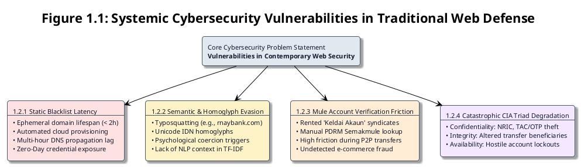
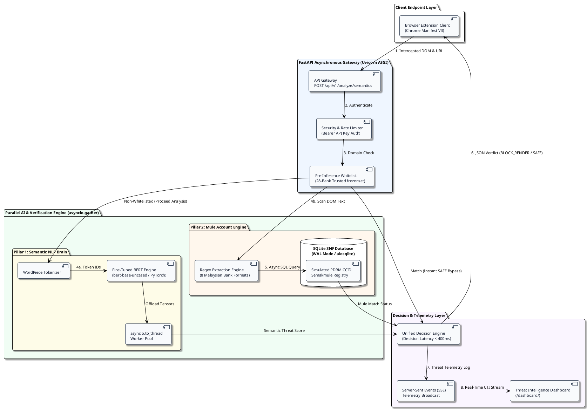
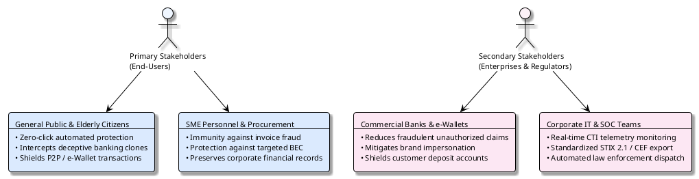
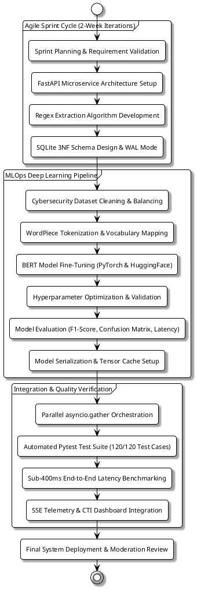

# Design and Development of ‘PhishGuard-AI’: A Multi-Modal Integrated Financial Scam Detection System utilising Hybrid Deep Learning

## Individual Module: Semantic Threat Intelligence and Mule Account Verification Engine

**By:**  
**Liew Yi Ler**  
**Student ID:** 25WMR09747  
**Programme:** Bachelor of Information Technology (Honours) in Information Security  
**Supervisor:** Mr. Tan Yock Khang  

**Faculty of Computing and Information Technology (FOCS)**  
**Tunku Abdul Rahman University of Management and Technology (TAR UMT)**  
**Kuala Lumpur**  
**Academic Year:** 2026/2027  

---

### Copyright & Declaration

*A project report submitted to the Faculty of Computing and Information Technology in partial fulfillment of the requirement for the Bachelor of Information Technology (Honours) in Information Security.*

*Copyright © 2026/2027 by Tunku Abdul Rahman University of Management and Technology. All rights reserved. No part of this project documentation may be reproduced, stored in a retrieval system, or transmitted in any form or by any means without prior permission of Tunku Abdul Rahman University of Management and Technology.*

#### Declaration
The project submitted herewith is a result of my own efforts in totality and in every aspect of the project works. All information that has been obtained from other sources has been fully acknowledged. I understand that any plagiarism, cheating, or collusion of any sort constitutes a breach of Tunku Abdul Rahman University of Management and Technology (TAR UMT) rules and regulations and would be subjected to disciplinary actions.

<br/>

________________________________________  
**Liew Yi Ler**  
Bachelor of Information Technology (Honours) in Information Security  
Student ID: 25WMR09747  

---

### Abstract

Financial scams and online phishing constitute the most critical cybersecurity threats within Malaysia, inflicting billions of Ringgit in economic losses annually. Contemporary web defensive mechanisms heavily depend on static, blacklist-based DNS filtering, which systematically fails against short-lived "Zero-Day" phishing campaigns, fast-flux infrastructures, and deceptive social engineering tactics. To bridge this critical security gap, the **PhishGuard-AI** multi-modal browser security suite was developed. This dissertation specifically details the individual research, architectural design, implementation, and empirical evaluation of the backend intelligence core: the **Semantic Threat Intelligence and Mule Account Verification Engine**.

The principal objective of this module is to transform web endpoint defence from reactive signature matching into proactive, contextual artificial intelligence analysis. A Deep Learning Bidirectional Encoder Representations from Transformers (BERT) model was fine-tuned on localized cybersecurity datasets to perform real-time semantic analysis on raw webpage Document Object Model (DOM) text and URL strings, autonomously recognizing urgency triggers, typosquatting patterns, and psychological coercion cues in English, Bahasa Melayu, and Manglish. To neutralize localized financial fraud, a dedicated Mule Account Verification Engine was engineered using pre-compiled Regular Expressions (Regex) and an asynchronous SQLite 3NF database in Write-Ahead Logging (WAL) mode, cross-referencing extracted 10-to-14 digit account numbers against a simulated Royal Malaysia Police (PDRM) CCID *Semakmule* intelligence registry.

These components are orchestrated through a high-concurrency Python FastAPI backend running on a Uvicorn ASGI server. By combining parallel thread offloading (`asyncio.to_thread`) with concurrent execution (`asyncio.gather()`), the backend achieves sub-400ms decision latencies while exposing real-time Cyber Threat Intelligence (CTI) telemetry through a centralized dashboard. The resulting architecture establishes a high-availability, zero-trust browsing defense capable of mitigating evasive financial fraud with zero user friction.

---

### Acknowledgement

First and foremost, I would like to express my deepest gratitude to my Final Year Project supervisor, **Mr. Tan Yock Khang**, for his invaluable mentorship, technical insights, and continuous academic guidance throughout the research and development phases of this project. His deep expertise in information security significantly elevated the technical rigor and analytical depth of this dissertation.

I also wish to extend my sincere appreciation to the **Faculty of Computing and Information Technology (FOCS)** at Tunku Abdul Rahman University of Management and Technology (TAR UMT) for providing the computing infrastructure, institutional resources, and foundational curriculum necessary to undertake this engineering endeavor.

Special thanks are extended to my project partner, **Cheon Jie Han**, for his dedication, technical synergy, and excellent collaboration on the frontend client-side Chrome extension and visual brand analysis modules of the PhishGuard-AI suite.

Finally, I express my profound gratitude to my family and peers for their unwavering moral support, encouragement, and patience throughout the entirety of my academic journey.

---

### Table of Contents

- **Chapter 1: Introduction**
  - 1.1 Background of the Study
  - 1.2 Problem Statement
    - 1.2.1 The Latency of Static Blacklists Against Zero-Day Ephemeral Threats
    - 1.2.2 Evasion via Semantic Manipulation and Contextual Obfuscation
    - 1.2.3 High Friction in the Verification of Localised Mule Accounts
    - 1.2.4 Degradation of the CIA Triad in Digital Transactions
  - 1.3 Objectives
  - 1.4 Solution: The Proposed Framework
    - 1.4.1 Securing Web Browsing with Dynamic Semantic Analysis
    - 1.4.2 Preventing Fraud via Automated Credential Verification
    - 1.4.3 Enhancing System Availability via Asynchronous Microservices
  - 1.5 Target Market
  - 1.6 Advantages & Contributions
  - 1.7 Project Plan
    - 1.7.1 Project Scope & Task Allocation
    - 1.7.2 Milestones & Schedule
    - 1.7.3 Software Development Model (Hybrid Agile-MLOps)
  - 1.8 Project Team & Organization
  - 1.9 Chapter Summary and Evaluation
- **Chapter 2: Literature Review** *(Upcoming)*
- **Chapter 3: Methodology and Requirements Analysis** *(Upcoming)*
- **Chapter 4: System Design** *(Upcoming)*
- **Chapter 5: Implementation and Testing** *(Upcoming)*
- **Chapter 6: Discussions and Conclusion** *(Upcoming)*
- **References**
- **Appendices**

---

# CHAPTER 1: INTRODUCTION

## 1.1 Background of the Study

In the contemporary era of the Fourth Industrial Revolution (IR 4.0), global and domestic financial ecosystems have undergone an irreversible paradigm shift toward real-time digital payment channels. Within Malaysia, comprehensive national digitalization strategies—most notably the *MyDIGITAL* Blueprint and Bank Negara Malaysia's (BNM) *Financial Sector Blueprint 2022–2026*—have expedited the ubiquity of instant retail payment platforms such as DuitNow, Touch 'n Go eWallet, ShopeePay, and integrated online banking interfaces (Bank Negara Malaysia, 2023). This digital evolution has democratized financial access across both metropolitan and rural populations.

However, this accelerated transition has fundamentally expanded the attack surface for cyber adversaries. As the technical barriers to conducting digital financial transactions have decreased, end-users—many of whom possess limited cybersecurity literacy—have become increasingly exposed to sophisticated, multi-channel cyber threats. When sensitive banking credentials, Transaction Authorization Codes (TAC/OTP), and identity data are compromised, the consequences extend beyond individual monetary ruin to precipitate a systemic erosion of public trust in national digital banking infrastructure.

Empirical crime statistics published by CyberSecurity Malaysia and the Royal Malaysia Police (PDRM) Commercial Crime Investigation Department (CCID) establish financial fraud and credential phishing as the dominant cyber threats in Malaysia. In 2023 alone, total monetary losses attributed to online scams, telecommunication fraud, and credential harvesting exceeded **RM 1.3 billion**, with over 34,000 discrete fraud incidents recorded nationwide (CyberSecurity Malaysia, 2024).

```
+----------------------------------------------------------------------------------------------------+
|                               EVOLUTION OF FINANCIAL PHISHING VECTORS                              |
+----------------------------------------------------------------------------------------------------+
| Traditional Phishing (2010s)       | Modern Evasive Phishing (2020s - Present)                     |
| ---------------------------------- | ------------------------------------------------------------- |
| • Static, poorly phrased emails    | • Localized context (Bahasa Melayu / Manglish / NRIC lures)    |
| • Generic HTTP hyperlinks          | • Ephemeral Zero-Day domains (< 2-hour lifespan)              |
| • Obvious domain anomalies         | • Internationalized Domain Name (IDN) & Typosquatting         |
| • Flagged by global blacklists     | • Quishing (PayNet EMVCo QR Codes) & "Keldai Akaun" Mules     |
+----------------------------------------------------------------------------------------------------+
```

Historically, phishing campaigns relied on poorly constructed, mass-distributed emails with glaring grammatical irregularities that were easily intercepted by perimeter spam filters. Today, threat actors deploy algorithmically generated, localized campaigns utilizing Domain Generation Algorithms (DGA), fast-flux DNS networks, and natural language generation to mimic authentic financial communication (Alkhalil et al., 2021; Opara et al., 2023). Furthermore, malicious actors increasingly exploit non-traditional attack vectors, such as **Quishing** (QR code phishing embedding fraudulent DuitNow payment proxies) and fraudulent money-mule bank accounts (*Keldai Akaun*).

To counter these evolving threats, this research proposes the design and implementation of **PhishGuard-AI**, an intelligent, multi-modal endpoint security suite. Departing from static link filtering, PhishGuard-AI incorporates proactive Deep Learning and real-time fraud heuristics at the endpoint. To ensure high-standard engineering rigor, the project is architecturally divided into two core modules:
1. **Module 1 (Backend Server & AI Core - Liew Yi Ler):** *Semantic Threat Intelligence and Mule Account Verification Engine*.
2. **Module 2 (Frontend Client & Computer Vision - Cheon Jie Han):** *Visual Identity Analysis and Browser Integration*.

This dissertation focuses strictly on the research, algorithmic design, and engineering of **Module 1**, providing an asynchronous, highly available intelligence backend capable of sub-second threat interception.

---

## 1.2 Problem Statement

Despite continuous enhancements in modern web browser sandboxing and transport-layer encryption, end-users remain persistently vulnerable to financial fraud due to four systemic vulnerabilities in traditional defensive architectures:


*Figure 1.1: Systemic Cybersecurity Vulnerabilities in Traditional Web Defense.*

### 1.2.1 The Latency of Static Blacklists Against Zero-Day Ephemeral Threats
Conventional web security predominantly relies on deterministic, signature-based blacklists (e.g., Google Safe Browsing, DNSBL, SURBL). However, contemporary phishing operations leverage automated cloud provisioning to instantiate thousands of disposable domains daily. Security research reveals that over **60% of modern phishing domains remain active for under two hours** (NIST, 2023). The manual reporting, verification, and DNS propagation cycle requires several hours to days, creating a catastrophic "Time-to-Protect" lag during which victim credentials are harvested before the malicious host is ever flagged.

### 1.2.2 Evasion via Semantic Manipulation and Contextual Obfuscation
Adversaries bypass standard string-matching and keyword-frequency filters (e.g., TF-IDF) by deploying semantic manipulation. This encompasses typosquatting (e.g., `rnaybank.com` mimicking `maybank.com`), Unicode Internationalized Domain Name (IDN) homoglyphs, and psychological pressure triggers (such as fabricated countdown timers, urgent court arrest warnings, or imminent account suspension threats) embedded within the Document Object Model (DOM). Traditional heuristics lack natural language comprehension, generating high false-negative rates against contextually sophisticated attacks (Sahingoz et al., 2019).

### 1.2.3 High Friction in the Verification of Localised Mule Accounts
In the Malaysian cybercrime ecosystem, illicit transaction proceeds are overwhelmingly routed through rented or hijacked third-party bank accounts known as *Keldai Akaun* (Money Mules). While the PDRM CCID maintains the *Semakmule* registry, verifying a counterparty requires users to manually copy bank account strings, leave their active transaction screen, and manually query the government portal. This high-friction, multi-step workflow is rarely executed during fast-paced e-commerce or peer-to-peer transfers, enabling money-mule networks to operate unchecked.

### 1.2.4 Degradation of the CIA Triad in Digital Transactions
A successful phishing compromise initiates cascading failures across the fundamental pillars of the CIA Triad:
* **Confidentiality:** Attacking actors harvest private banking credentials, NRIC identification numbers, passwords, and 6-digit Transaction Authorization Codes (TAC/OTP).
* **Integrity:** Attackers manipulate recipient beneficiaries, execute unauthorized wire transfers, or alter stored digital asset states.
* **Availability:** Victims are locked out of legitimate online banking sessions following hostile password and recovery-credential alterations.

---

## 1.3 Objectives

The overarching aim of this individual module is to engineer an asynchronous, resilient, AI-driven backend infrastructure capable of real-time semantic classification and autonomous money-mule account verification. The specific research and engineering objectives are:

1. **To engineer an AI-powered Semantic Threat Intelligence Engine for Real-Time Zero-Day Phishing Detection:**  
   Fine-tune a deep bidirectional Transformer architecture (**BERT - `bert-base-uncased`**) on domain-specific cybersecurity datasets, enabling autonomous contextual classification of intercepted webpage DOM text, typosquatted URLs, and psychological urgency triggers with calibrated confidence outputs.

2. **To design and implement a Localised Mule Account Verification Engine with Sub-Millisecond Matching:**  
   Develop high-efficiency pre-compiled Regular Expression (Regex) algorithms targeting 8 distinct Malaysian commercial bank account formats (10 to 14 digits) and DuitNow proxies, integrated with an asynchronous SQLite 3NF database in Write-Ahead Logging (WAL) mode to cross-reference extracted credentials against a simulated PDRM CCID *Semakmule* registry in real time.

3. **To develop a High-Concurrency, Low-Latency Asynchronous FastAPI Microservice Architecture:**  
   Construct a robust RESTful API gateway leveraging Python's `asyncio` event loop, thread offloading (`asyncio.to_thread`), and parallel execution (`asyncio.gather()`) to ensure end-to-end inference and verification response times remain strictly under **400 milliseconds**, preserving an unhindered user browsing experience while serving real-time Cyber Threat Intelligence (CTI) telemetry to a SOC dashboard.

---

## 1.4 Solution: The Proposed Framework

To address the aforementioned vulnerabilities, the PhishGuard-AI backend implements a multi-layered, defense-in-depth architecture:


*Figure 1.2: PhishGuard-AI Backend Engine Architecture and Parallel Verification Pipeline.*

### 1.4.1 Dynamic Semantic Analysis via Fine-Tuned BERT
To mitigate zero-day blacklist latency, the backend utilizes a fine-tuned BERT Deep Learning model. By processing raw DOM tokens bidirectionally through multi-head self-attention mechanisms, the engine discerns deceptive social engineering intent regardless of whether the domain was registered minutes prior. Furthermore, a pre-inference **28-Bank Trusted Domain Whitelist (`frozenset`)** immediately validates authentic Malaysian banking portals (`maybank2u.com.my`, `pbebank.com.my`), ensuring zero false alarms.

### 1.4.2 Autonomous Mule Account Verification
To eliminate manual verification friction, the engine employs pre-compiled Regular Expressions targeting the unique account numbering standards of 8 leading Malaysian commercial banks (e.g., Maybank 12-digit, CIMB 14-digit, Public Bank 10-digit). Extracted account candidates are checked against an indexed SQLite database using asynchronous queries (`aiosqlite`), instantly flagging illicit accounts without user intervention.

### 1.4.3 Asynchronous Microservice Orchestration
To prevent deep learning tensors from blocking the I/O event loop, all PyTorch inferences are offloaded to asynchronous worker threads (`asyncio.to_thread`) and executed concurrently with database operations using `asyncio.gather()`. This achieves sub-second decision delivery (< 400ms) with full Server-Sent Events (SSE) telemetry broadcasted to the centralized Threat Intelligence Dashboard at `/dashboard`.

---

## 1.5 Target Market


*Figure 1.3: Target Market and Stakeholder Ecosystem Hierarchy.*

---

## 1.6 Advantages & Contributions

The primary contributions of this research and software artifact include:

1. **Proactive Zero-Day Interception:** Replaces vulnerable blacklist-checking with semantic contextual intelligence, eliminating the multi-hour vulnerability window.
2. **Autonomous Domestic Fraud Shield:** Provides the first automated DOM-integrated verification against Malaysian money-mule accounts and DuitNow proxies.
3. **Strict Data Privacy by Design:** Executes inference locally or on designated microservices without transmitting sensitive user DOM payloads to third-party public LLMs.
4. **Alignment with UN Sustainable Development Goals (SDGs):**
   * **SDG 9 (Industry, Innovation, and Infrastructure):** Developing robust, resilient digital financial infrastructure.
   * **SDG 16 (Peace, Justice, and Strong Institutions):** Combating cybercrime and illicit financial syndicates.

---

## 1.7 Project Plan

### 1.7.1 Project Scope & Task Allocation

The PhishGuard-AI project is structured into two distinct engineering domains to maintain strict separation of concerns, as detailed in Table 1.1.

**Table 1.1: System Module Allocation and Scope Boundary**

| Module Category | Functional Scope & Deliverables | Assigned Member |
| :--- | :--- | :---: |
| **Semantic Threat Intelligence Engine** | Training, fine-tuning, and evaluating the BERT (`bert-base-uncased`) NLP model for text classification, urgency detection, and typosquatting analysis. | **Liew Yi Ler** |
| **Mule Account Database Engineering** | SQLite 3NF database schema design, WAL mode configuration, pre-compiled Regex algorithms for 8 Malaysian bank formats, and query optimization. | **Liew Yi Ler** |
| **Backend API Gateway & Telemetry** | FastAPI asynchronous routing, Bearer API token security, PyTorch inference thread-offloading, SSE event streaming, and CTI dashboard development. | **Liew Yi Ler** |
| **Visual Identity Analysis (CNN/Vision)** | Convolutional Neural Network / YOLOv8 logo detection model training on the PhishPedia dataset for brand emblem recognition. | Cheon Jie Han |
| **Browser Extension Client (Manifest V3)** | Google Chrome Manifest V3 service workers, DOM extraction scripts, full-screen `BLOCK_RENDER` shield, and XAI highlight overlays. | Cheon Jie Han |

### 1.7.2 Milestones & Project Schedule

**Table 1.2: Research and Implementation Milestones**

| Phase / Milestone | Expected Technical Deliverable | Target Timeline | Status |
| :--- | :--- | :---: | :---: |
| **1. Project Proposal & Moderation** | Formal proposal submission, problem validation, and supervisor approval. | June 2026 | ✅ Completed |
| **2. Chapter 1: Introduction** | Formulation of problem statement, research objectives, and project plan. | July 2026 | ✅ Completed |
| **3. Chapter 2: Literature Review** | Comparative synthesis of NLP/BERT models, Regex engines, and blacklist latencies. | August 2026 | ⏳ In Progress |
| **4. Chapter 3: Methodology & Requirements** | Specification of functional/non-functional requirements, UML diagrams, and MLOps pipeline. | September 2026 | ⏳ Queued |
| **5. Chapter 4: System Design** | Architectural diagrams, 3NF database schema, and mathematical formulation of BERT attention. | October 2026 | ⏳ Queued |
| **6. Project I Portfolio Submission** | Interim documentation and preliminary backend prototype validation. | November 2026 | ⏳ Queued |
| **7. System Implementation & Unit Testing** | API endpoint construction, Regex optimization, and automated Pytest test suite creation. | Dec 2026 – Jan 2027 | ⏳ Queued |
| **8. Final Verification & Report Submission** | Empirical evaluation, CTI dashboard completion, and final dissertation submission. | Feb – March 2027 | ⏳ Queued |

### 1.7.3 Software Development Methodology (Hybrid Agile-MLOps)

The project adopts a hybrid **Agile-MLOps** development lifecycle. Agile principles provide iteration flexibility across 2-week development sprints, while MLOps protocols manage dataset balance, hyperparameter tuning, model versioning, and inference latency benchmarks.


*Figure 1.4: Hybrid Agile-MLOps Development Lifecycle Workflow.*

---

## 1.8 Project Organization

**Table 1.3: Project Team Task Matrix**

| Functional Component | Backend Server (Python / FastAPI) | Frontend Client (Chrome Extension) |
| :--- | :--- | :--- |
| **Semantic Intelligence** | **Liew Yi Ler:** BERT NLP tokenization, fine-tuning, and semantic scoring. | — |
| **Mule Account Verification** | **Liew Yi Ler:** Regex bank parsers, aiosqlite WAL database, and Semakmule lookup. | — |
| **API Gateway & Routing** | **Liew Yi Ler:** Asynchronous endpoints, Bearer auth, SSE streaming, and CTI dashboard. | — |
| **Visual Brand Recognition** | — | **Cheon Jie Han:** CNN/YOLOv8 logo classification and visual match scoring. |
| **DOM & Screenshot Capture** | — | **Cheon Jie Han:** Manifest V3 Content Scripts and headless image capture. |
| **Client Alerts & UX** | — | **Cheon Jie Han:** Interstitial warning overlay, popup UI, and XAI highlight injection. |
| **End-to-End Integration** | **Liew Yi Ler:** Backend API orchestration and live SSE event broadcast. | **Cheon Jie Han:** Chrome extension runtime messaging and API integration. |

---

## 1.9 Chapter Summary and Evaluation

This chapter established the contextual background, systemic problem statements, research objectives, and architectural foundation of the **PhishGuard-AI Semantic Threat Intelligence and Mule Account Verification Engine**. 

The investigation revealed that traditional signature blacklists fail against zero-day phishing due to significant time-to-protect delays, while social engineering and money-mule accounts exploit localized communication channels. To solve these challenges, this individual module implements a fine-tuned BERT deep learning engine, pre-compiled Regex credential parsers, and an asynchronous SQLite/FastAPI microservice capable of executing parallel evaluations in under 400 milliseconds. 

The scope, target market, academic contributions, project schedule, and Agile-MLOps methodology were formally demarcated. Subsequent chapters will provide an exhaustive academic literature review (Chapter 2), methodology and requirements analysis (Chapter 3), system design specifications (Chapter 4), implementation and empirical test results (Chapter 5), and final research discussions (Chapter 6).
