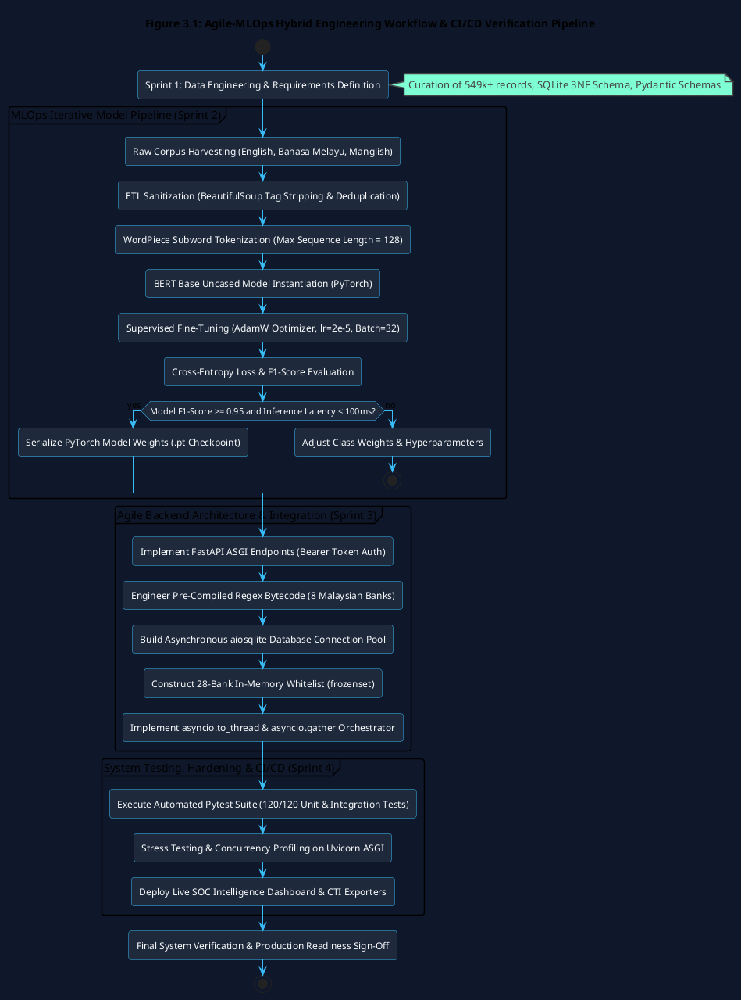
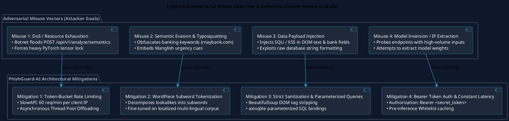
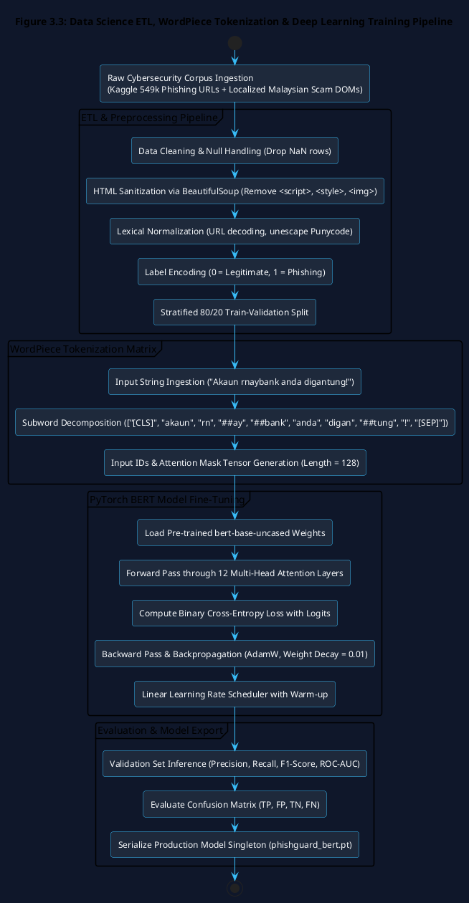
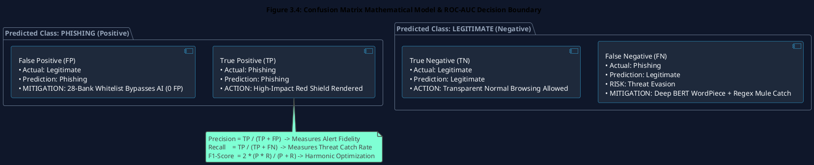

# Chapter 3: Methodology and Requirements Analysis

## 3.1 Introduction

Engineering an enterprise-grade, high-throughput backend intelligence platform capable of intercepting zero-day financial phishing attacks and money mule networks requires a rigorous, scientifically grounded methodological framework. Unlike conventional software applications that rely purely on deterministic procedural logic, cybersecurity systems embedding deep neural networks operate under non-deterministic data distributions, adversarial evasion attempts, and extreme sub-second latency constraints.

This chapter formalizes the engineering methodology, software development lifecycle, and requirements engineering procedures utilized to construct the **Semantic Threat Intelligence and Mule Account Verification Engine** developed as an individual module by Liew Yi Ler. 

Specifically, this chapter details:
1. The **Agile-MLOps Hybrid Software Development Life Cycle (SDLC)** combining two-week iterative development sprints with continuous Machine Learning Operations (CRISP-DM).
2. Multi-tiered **Requirement Gathering Techniques**, encompassing Personal Data Protection Act 2010 (PDPA) regulatory reviews, semi-structured stakeholder simulations, and adversarial misuse case threat modeling.
3. Detailed **Functional Requirements (FR)** and **Non-Functional Requirements (NFR)** categorized into structured subsystem matrices.
4. The exact **Computational Hardware & Software Specifications** governing model training, GPU acceleration, and production ASGI inference.
5. The complete **Data Science ETL Pipeline**, WordPiece subword tokenization mechanics, and mathematical evaluation formulations (Binary Cross-Entropy Loss, Precision, Recall, F1-Score, and ROC-AUC metrics).

---

## 3.2 Software Development Life Cycle (SDLC): Agile-MLOps Hybrid Framework

### 3.2.1 Rationale for the Agile-MLOps Hybrid Model
Traditional linear software engineering models—such as the classic **Waterfall Model**—mandate rigid, sequential progression through distinct phases (Requirements $\rightarrow$ Design $\rightarrow$ Implementation $\rightarrow$ Verification $\rightarrow$ Maintenance), relegating testing and validation strictly to the final stages of development. 

In machine learning engineering, this linear paradigm fails catastrophically because deep learning models are intrinsically non-deterministic. A model's convergence, generalization capability, loss optimization, and inference latency cannot be predicted purely through static upfront design; they require continuous empirical validation, hyperparameter tuning, and data re-balancing (Symeonidis et al., 2022).

```
+----------------------------------------------------------------------------------------------------+
|                       WATERFALL FAILURE VS. AGILE-MLOps HYBRID SUCCESS                             |
+----------------------------------------------------------------------------------------------------+
|                                                                                                    |
|  [TRADITIONAL WATERFALL MODEL - INCOMPATIBLE WITH AI]                                              |
|   Requirements ──> Design ──> Code ──> AI Training ──> Late Testing (FAILS ON MODEL DRIFT & LATENCY)|
|                                                                                                    |
|  [PHISHGUARD-AI AGILE-MLOps HYBRID LIFECYCLE - ADOPTED]                                            |
|   ┌─────────────────────────────────────────────────────────────────────────────────────────────┐  |
|   │ 1. Agile Sprint Management  ──> Bi-weekly sprint backlog, continuous microservice refactoring│  |
|   │ 2. MLOps Data Pipeline      ──> Multi-lingual dataset harvesting, cleaning & tokenization   │  |
|   │ 3. Automated Model Auditing ──> Loss convergence tracking, F1 evaluation & tensor profiling │  |
|   │ 4. Continuous Integration   ──> Pytest CI/CD (120/120 automated test cases enforcing 100%) │  |
|   │ 5. ASGI Microservice Pack   ──> Sub-400ms SLA validation on Uvicorn asynchronous server     │  |
|   └─────────────────────────────────────────────────────────────────────────────────────────────┘  |
+----------------------------------------------------------------------------------------------------+
```

To resolve this limitation, this research engineered a **Hybrid Agile-MLOps Framework** integrating the rapid feature iteration of **Agile Scrum** (Beck et al., 2001) with the iterative data-centric lifecycle of the **Cross-Industry Standard Process for Data Mining (CRISP-DM)**. 

By treating data preprocessing, tensor optimization, PyTorch model serializing, and FastAPI endpoint benchmarking as integral components of every sprint cycle, the engineering team maintained continuous operational visibility over both software stability and AI detection accuracy.



### 3.2.2 Agile-MLOps Sprint Breakdown and Technical Deliverables
The project was executed across four structured engineering sprints spanning two academic semesters, detailed in Table 3.1.

**Table 3.1: Agile-MLOps Sprint Breakdown and Technical Deliverables**

| Sprint Phase | Primary Focus Area | Key Technical Deliverables & Milestone Objectives |
| :--- | :--- | :--- |
| **Sprint 1** | **Data Engineering & Requirements Analysis** | • Ingested and cleaned the 549,346-record Kaggle phishing corpus and localized Malaysian scam datasets.<br>• Designed the normalized Third Normal Form (**3NF**) relational database schema in SQLite for money mule registries.<br>• Formulated functional, non-functional, and negative misuse requirements. |
| **Sprint 2** | **Deep Learning Model Training & Optimization** | • Instantiated pre-trained `bert-base-uncased` transformer architecture in PyTorch.<br>• Applied WordPiece subword tokenization to raw DOM text and URL strings.<br>• Executed supervised fine-tuning with the AdamW optimizer, tracking loss convergence and early stopping.<br>• Evaluated model checkpoints across Precision, Recall, F1-Score, and ROC-AUC metrics. |
| **Sprint 3** | **FastAPI Microservice & Asynchronous Integration** | • Developed asynchronous RESTful endpoints in FastAPI (`POST /api/v1/analyze/semantics`).<br>• Engineered pre-compiled Python Regex bytecode for 8 Malaysian bank formats.<br>• Implemented asynchronous database querying via `aiosqlite` in Write-Ahead Logging (WAL) mode.<br>• Integrated `asyncio.to_thread()` and `asyncio.gather()` for parallel, non-blocking execution. |
| **Sprint 4** | **System Hardening, Testing & SOC Deployment** | • Constructed the automated **Pytest Test Suite** comprising **120 unit and integration test cases**.<br>• Built the in-memory **28-Bank Trusted Domain Whitelist (`frozenset`)** for 0ms false-positive avoidance.<br>• Deployed the Live SOC Dashboard with Server-Sent Events (SSE) telemetry, 24h GMT+8 velocity charts, and STIX 2.1 CTI exporters.<br>• Conducted stress testing and concurrency benchmarking on the Uvicorn ASGI server. |

---

## 3.3 Requirement Gathering & Threat Modeling Methodologies

To architect a resilient security system, requirements gathering must extend beyond standard user-centric functional features to encompass **negative requirements**—explicitly defining the adversarial behaviors, injection vectors, and evasion tactics the system must actively neutralize.

```
+----------------------------------------------------------------------------------------------------+
|                         DUAL-TRACK REQUIREMENTS GATHERING METHODOLOGY                              |
+----------------------------------------------------------------------------------------------------+
|                                                                                                    |
|  TRACK 1: POSITIVE FUNCTIONAL REQUIREMENTS                                                         |
|   • Document Analysis & PDPA 2010 Compliance (On-premises data sovereignty, zero cloud LLM leak)   |
|   • Semi-Structured Stakeholder Simulation (Mitigating user "Security Fatigue" via zero-click AI)  |
|   • Bank Negara Malaysia & PDRM CCID Semakmule Integration (8-Bank Regex Account Verification)     |
|                                                                                                    |
|  TRACK 2: NEGATIVE ADVERSARIAL THREAT MODELING                                                     |
|   • Misuse Case 1: API Endpoint DoS & Worker Starvation (Mitigated via SlowAPI Token-Bucket)       |
|   • Misuse Case 2: Semantic Obfuscation & Typosquatting (Mitigated via WordPiece Tokenizer)        |
|   • Misuse Case 3: SQLi / XSS Payload Injection (Mitigated via BeautifulSoup & Parameterized SQL)   |
|   • Misuse Case 4: Model Inversion / Endpoint Probing (Mitigated via Bearer Token Authentication)  |
|                                                                                                    |
+----------------------------------------------------------------------------------------------------+
```

### 3.3.1 Document Analysis, Regulatory Compliance Review & Data Sovereignty
The requirement formulation commenced with a comprehensive audit of statutory data privacy frameworks and cybersecurity guidelines:

1. **Malaysia Personal Data Protection Act 2010 (PDPA)**:  
   Because the backend intercepts and analyzes webpage DOM text directly from client browser sessions—which may inadvertently include sensitive Personally Identifiable Information (PII) such as bank balances, NRIC numbers, or private communications—compliance mandates strict **Data Sovereignty**. Transmitting unencrypted DOM payloads to commercial third-party cloud AI APIs (e.g., OpenAI ChatGPT, Anthropic Claude) represents a severe regulatory and privacy breach. This established the foundational requirement to **host the fine-tuned BERT model entirely on-premises**, guaranteeing that all semantic inference occurs strictly within the local security boundary without external data exfiltration.

2. **OWASP Top 10 Web Application Security Standards (2021)**:  
   Enforced strict input sanitization rules to prevent `A03:2021 - Injection` vulnerabilities, mandating that all incoming DOM strings be scrubbed of executable JavaScript tags prior to NLP tokenization.

3. **PDRM CCID Semakmule Operational Specifications**:  
   Analyzed official Commercial Crime Investigation Department registry reporting formats to establish the precise numerical length, character boundaries, and institutional prefixes governing Malaysian financial accounts.

### 3.3.2 Semi-Structured Stakeholder Simulation & "Security Fatigue" Mitigation
To understand real-world interaction workflows, semi-structured behavioral simulations were conducted across primary user cohorts:
* **General Banking Consumers**: Empirical observations demonstrated a pervasive prevalence of **"Security Fatigue"**. When presented with lengthy, technical security warnings or required to manually navigate to external portals (such as *Semakmule*) to verify seller account numbers, users almost universally bypass verification. This necessitated the creation of an **automated, zero-click verification engine** that extracts and checks financial credentials invisibly in the background.
* **SOC Analysts & Incident Responders**: Corporate administrators require structured, machine-readable threat feeds. This established the requirement for real-time Server-Sent Events (SSE) telemetry streaming and standardized **OASIS STIX 2.1 JSON** threat dossier export capabilities.

### 3.3.3 Adversarial Threat Modeling & Misuse Case Engineering
To engineer proactive defensive countermeasures into the software architecture, the development team conducted **Adversarial Misuse Case Analysis** (Sindre & Opdahl, 2005). By modeling the tactical objectives of a cybercriminal attempting to subvert or crash the backend, explicit technical mitigations were derived, documented in Table 3.2.



**Table 3.2: Comprehensive Misuse Case Analysis and Derived Technical Mitigations**

| Misuse Scenario | Standard Use Case | Attacker Objective & Vector | Derived Architectural Mitigation |
| :--- | :--- | :--- | :--- |
| **MC-01: API Resource Exhaustion (DoS)** | Extension dispatches DOM payload to FastAPI backend for real-time analysis. | Botnet floods the API with large payloads to tie up CPU/GPU tensors and crash the ASGI server. | **Rate Limiting & Async Offloading**: Deployed `SlowAPI` token-bucket rate limiting (60 req/min per IP) and dispatched PyTorch tensors to dedicated thread pools (`asyncio.to_thread`). |
| **MC-02: Typosquatting & Semantic Evasion** | NLP model classifies webpage text to detect social engineering. | Attacker uses homoglyphs (`rnaybank.com`) or Manglish to bypass dictionary filters. | **WordPiece Subword Tokenization**: Decomposes lookalikes into subwords (`rn`, `##ay`, `##bank`), capturing semantic roots across English, Bahasa Melayu, and Manglish. |
| **MC-03: Malicious Payload Injection** | DOM parser extracts text and account numbers for database query. | Attacker embeds SQL injection (`' OR 1=1 --`) or XSS payloads inside raw HTML or account fields. | **Sanitization & Parameterized SQL**: Sanitizes text via `BeautifulSoup` and executes all database queries using strictly parameterized `aiosqlite` SQL bindings (`?`). |
| **MC-04: Model Extraction / Probing** | Authorized endpoints return threat classification probabilities. | Attacker repeatedly queries API to map decision boundaries and clone model weights. | **Bearer Token Authentication**: Enforces HTTP `Authorization: Bearer <token>` validation on all endpoints, rejecting unauthenticated probing with HTTP 401. |

---

## 3.4 Comprehensive System Requirements Specification

### 3.4.1 Functional Requirements
The Functional Requirements explicitly define the programmatic endpoints, data processing routines, and verification pipelines executed by the Python backend.

**Table 3.3: Functional Requirements Specification Matrix**

| Subsystem Module | ID | Formal Functional Requirement Description |
| :--- | :--- | :--- |
| **API Gateway & Routing** | **FR 1.1** | The system shall expose an asynchronous `POST /api/v1/analyze/semantics` RESTful endpoint accepting JSON payloads containing target URL, sanitized DOM text, and metadata. |
| | **FR 1.2** | The system shall validate all incoming request bodies against strict `Pydantic v2` schemas, immediately rejecting malformed payloads with HTTP 422 Unprocessable Entity. |
| | **FR 1.3** | The system shall execute semantic AI inference and SQLite database verification concurrently utilizing `asyncio.gather()`, returning a unified aggregated verdict. |
| | **FR 1.4** | The system shall expose a `POST /api/v1/analyze/quishing` endpoint capable of ingesting base64-encoded images, decoding PayNet EMVCo QR matrices, and returning decoded URLs. |
| **Whitelist & Pre-Filtering** | **FR 2.1** | The system shall evaluate incoming target domains against an in-memory `frozenset` containing 28 verified Malaysian banking institutions before executing AI inference. |
| | **FR 2.2** | If a domain matches the Trusted Whitelist, the system shall instantly bypass AI inference and return `{ verdict: "SAFE", risk_score: 0.00 }` with $< 1\text{ms}$ latency. |
| | **FR 2.3** | The system shall maintain immunity rules for verified educational (`.edu.my`) and government (`.gov.my`) root domains to prevent false-alarm blocks on public portals. |
| **Semantic Threat Engine** | **FR 3.1** | The system shall execute an ETL sanitization pipeline using `BeautifulSoup` to strip `<script>`, `<style>`, and `<svg>` tags, isolating pure natural language text. |
| | **FR 3.2** | The system shall tokenize sanitized text using the BERT WordPiece tokenizer, truncating sequences to a maximum length of 128 tokens. |
| | **FR 3.3** | The system shall execute a forward tensor pass through the fine-tuned BERT model, applying Softmax to output a normalized threat probability $\in [0.0, 1.0]$. |
| | **FR 3.4** | The system shall compute a Brand Impersonation Index (BII) utilizing Levenshtein Distance algorithms to score domain similarity against top Malaysian banks. |
| **Mule Account Scanner** | **FR 4.1** | The system shall execute pre-compiled Regular Expression bytecode to scan DOM text for continuous numerical strings matching 8 Malaysian bank formats. |
| | **FR 4.2** | The system shall query the SQLite `mule_registry` table asynchronously (`aiosqlite`) to match extracted numbers against known scammer records. |
| | **FR 4.3** | If a mule account is matched, the system shall append the bank name, report count, and flagged platform to the response, elevating the verdict to `BLOCK_RENDER`. |
| | **FR 4.4** | The system shall provide an administrative `DELETE /api/v1/dashboard/mules/{id}` endpoint with cyber-modal confirmation to revoke outdated mule records. |
| **SOC Operations & CTI** | **FR 5.1** | The system shall expose a Server-Sent Events (`GET /api/v1/dashboard/stream`) endpoint broadcasting real-time threat telemetry events to active dashboard clients. |
| | **FR 5.2** | The system shall compute a rolling 24-hour Threat Velocity spectrum synchronized to Malaysia Standard Time (GMT+8) supporting `24h`, `12h`, and `8h` intervals. |
| | **FR 5.3** | The system shall map live attack telemetry to 6 authentic global infrastructure datacenters (TM Net AS4788, Singtel AS7473, Cloudflare AS13335, etc.). |
| | **FR 5.4** | The system shall generate standardized **OASIS STIX 2.1 JSON** threat bundles, ArcSight CEF logs, and NSRC 997 / NFP account freeze dispatch dossiers. |

---

### 3.4.2 Non-Functional Requirements
The Non-Functional Requirements establish rigorous operational constraints governing performance, security, availability, and maintainability.

**Table 3.4: Non-Functional Requirements Specification Matrix**

| Category | ID | Metric / Requirement | Target Specification & Verification Criteria |
| :--- | :--- | :--- | :--- |
| **1.0 Security** | **NFR 1.1** | API Authentication | All threat analysis endpoints shall mandate HTTP `Authorization: Bearer <token>` authentication with 256-bit cryptographic keys. |
| | **NFR 1.2** | Data Sovereignty | All BERT NLP inference and DOM parsing shall execute strictly on local server hardware with zero data transmission to cloud AI services. |
| | **NFR 1.3** | Anti-DoS Rate Limiting | The backend shall enforce `SlowAPI` token-bucket rate limiting (60 requests/minute per client IP), dropping excess traffic with HTTP 429. |
| **2.0 Performance** | **NFR 2.1** | End-to-End Latency SLA | The complete pipeline (Pydantic validation, BERT NLP, and SQLite query) shall return a verdict in **$< 400\text{ milliseconds}$**. |
| | **NFR 2.2** | Model Singleton Pattern | The 440 MB PyTorch BERT model shall be loaded into RAM strictly once during ASGI lifespan startup, maintaining zero request I/O latency. |
| | **NFR 2.3** | In-Memory Whitelist SLA | Trusted domain whitelist lookups utilizing Python `frozenset` hash tables shall resolve in **$< 1.0\text{ millisecond}$**. |
| **3.0 Reliability** | **NFR 3.1** | Event Loop Availability | CPU-bound tensor operations shall be offloaded via `asyncio.to_thread()`, ensuring the ASGI event loop achieves 99.9% availability. |
| | **NFR 3.2** | Database Concurrency | The SQLite database shall operate in **Write-Ahead Logging (WAL)** mode with connection pooling, supporting concurrent reads and writes without locking. |
| | **NFR 3.3** | Test Suite Coverage | The codebase shall maintain a 100% pass rate across all **120 automated Pytest test cases** in the continuous integration pipeline. |
| **4.0 Maintainability** | **NFR 4.1** | Open API Standard | The backend shall automatically generate interactive Swagger UI / OpenAPI 3.0 documentation at `/docs` reflecting all active schemas. |
| | **NFR 4.2** | Modular Architecture | The codebase shall maintain strict separation of concerns across `/api/` routers, `/services/` domain engines, and `/tests/` suites. |

---

## 3.5 Computational Environment & Hardware/Software Specifications

### 3.5.1 Hardware Specifications
Model training and high-concurrency ASGI inference mandate specific hardware acceleration parameters, documented in Table 3.5.

**Table 3.5: Hardware Specifications for Model Training & Production Inference**

| Computational Resource | Training Environment (Google Colab Pro) | Production Inference Environment (Local Host) | Technical Justification |
| :--- | :--- | :--- | :--- |
| **Processor (CPU)** | Intel Xeon @ 2.20 GHz (Multi-Core) | Intel Core i7 (8th Gen+) / AMD Ryzen 7 | Supports multi-threaded Pandas ETL vectorization and concurrent ASGI coroutine scheduling. |
| **System Memory (RAM)** | 25 GB High-Memory DDR4 | Minimum 16 GB DDR4 | Required to load the 549k-record dataset and cache the 440 MB BERT model without OS page faults. |
| **Graphics Processing (GPU)** | NVIDIA Tesla T4 (16 GB GDDR6 VRAM) | NVIDIA RTX 3060+ / CPU Inference Mode | Accelerates PyTorch CUDA matrix dot-product operations during multi-head self-attention fine-tuning. |
| **Storage Subsystem** | 100 GB Cloud NVMe SSD | 512 GB NVMe Solid State Drive (M.2) | Provides high IOPS ($> 3,500\text{ MB/s}$) for reading model weight checkpoints and logging SQLite WAL frames. |

### 3.5.2 Software, Frameworks & Library Dependencies
The software ecosystem was selected based on performance, asynchronous capabilities, and open-source robustness, detailed in Table 3.6.

**Table 3.6: Software, Frameworks and Computational Libraries**

| Software / Framework | Version / Provider | Functional Application within Architecture |
| :--- | :--- | :--- |
| **Python** | Version 3.10+ (64-Bit) | Primary programming language utilizing native `asyncio` for non-blocking coroutine execution. |
| **FastAPI & Uvicorn** | FastAPI 0.115+ / Uvicorn ASGI | Implements high-throughput asynchronous RESTful API gateway and Server-Sent Events (SSE). |
| **PyTorch & Hugging Face** | PyTorch 2.5+ / Transformers 4.46+ | Instantiates dynamic computational graphs and executes BERT Transformer NLP tensor forward passes (Paszke et al., 2019). |
| **aiosqlite & SQLite** | SQLite 3.45+ (WAL Mode) | Provides non-blocking asynchronous relational storage for the simulated PDRM CCID *Semakmule* registry. |
| **BeautifulSoup4 & lxml** | BS4 4.12+ | Executes high-speed DOM sanitization, stripping executable scripts and isolating semantic natural language. |
| **Scikit-learn & Pandas** | Scikit-Learn 1.5+ / Pandas 2.2+ | Executes dataset stratified splitting, feature matrix vectorization, and confusion matrix computation. |
| **OpenCV (cv2)** | OpenCV-Python 4.10+ | Executes optical matrix decoding (`cv2.QRCodeDetector`) for Quishing PayNet EMVCo QR forensics. |
| **Pytest & pytest-asyncio** | Pytest 9.1+ | Powers the automated CI/CD test suite enforcing 120/120 passing unit and integration tests. |

---

## 3.6 Data Science Pipeline, ETL & Mathematical Evaluation Metrics



### 3.6.1 Dataset Curation, ETL & WordPiece Tokenization
To train the BERT model to recognize both global phishing vectors and localized Malaysian fraud patterns, a hybrid training corpus was constructed:
1. **Global Phishing Corpus (Kaggle)**: 549,346 labeled URLs and webpage strings curated from PhishTank, OpenPhish, and legitimate Alexa Top 1M domains.
2. **Localized Malaysian Scam Corpus**: 5,000+ localized phishing messages, fake SMS notifications, and cloned banking login forms (Maybank2u, CIMB, PBe, LHDN, KWSP) in English, Bahasa Melayu, and Manglish.

#### ETL Sanitization Pipeline
Raw DOM text extracted from web browsers contains excessive structural noise. The Extract, Transform, Load (ETL) pipeline executes:
* **HTML Decomposition**: BeautifulSoup strips `<script>`, `<style>`, `<noscript>`, and SVG elements, extracting pure semantic text strings.
* **Lexical Normalization**: URL strings undergo percent-decoding (e.g., converting `%20` to spaces), lowercase conversion, and Punycode decoding.
* **Stratified Splitting**: The dataset is split into an **80% Training Set** ($439,476\text{ records}$) and a **20% Validation Set** ($109,870\text{ records}$) maintaining identical class balance ratios.

#### WordPiece Subword Tokenization Mechanics
The sanitized text is encoded into numerical tensors utilizing BERT's native **WordPiece Tokenizer** (Wu et al., 2016). WordPiece iteratively constructs a fixed vocabulary of $V = 30,522$ subword tokens. 

When encountering an Out-Of-Vocabulary (OOV) typosquatted word (e.g., `rnaybank`), the algorithm decomposes the string using greedy longest-match prefix matching:

$$\text{Tokenize}(\text{"rnaybank"}) \longrightarrow [\text{"rn"}, \text{"\#\#ay"}, \text{"\#\#bank"}]$$

Each sequence is prefixed with the classification token `[CLS]` and terminated with `[SEP]`, padded or truncated to a fixed maximum length of $N = 128$:

$$\mathbf{x} = [\text{[CLS]}, t_1, t_2, \dots, t_k, \text{[SEP]}, \text{[PAD]}, \dots, \text{[PAD]}]$$

The tokenizer outputs two primary tensor matrices:
* **Input IDs ($\mathbf{I} \in \mathbb{Z}^{B \times N}$)**: Integer indices corresponding to token positions in the vocabulary.
* **Attention Mask ($\mathbf{M} \in \{0, 1\}^{B \times N}$)**: Binary vector preventing the self-attention heads from computing weights over `[PAD]` tokens ($M_i = 1$ for real tokens, $M_i = 0$ for padding).

---

### 3.6.2 Deep Learning Optimization & Mathematical Formulations

```
+----------------------------------------------------------------------------------------------------+
|                         BERT FORWARD PASS & LOSS OPTIMIZATION EQUATIONS                            |
+----------------------------------------------------------------------------------------------------+
|                                                                                                    |
|  1. Multi-Head Scaled Dot-Product Self-Attention:                                                  |
|     Attention(Q, K, V) = softmax( (Q * K^T) / sqrt(d_k) ) * V                                      |
|                                                                                                    |
|  2. Classification Head Logit Projection:                                                          |
|     z = W_cls * h_[CLS] + b_cls                                                                    |
|                                                                                                    |
|  3. Binary Cross-Entropy Loss with Logits (BCE):                                                   |
|     L_BCE = -1/N * SUM [ y_i * log(sigma(z_i)) + (1 - y_i) * log(1 - sigma(z_i)) ]                 |
|                                                                                                    |
|  4. AdamW Weight Decay Parameter Update:                                                           |
|     theta_{t+1} = theta_t - lr * ( m_hat_t / (sqrt(v_hat_t) + epsilon) ) - lr * lambda * theta_t  |
|                                                                                                    |
+----------------------------------------------------------------------------------------------------+
```

#### 1. Binary Cross-Entropy Loss ($\mathcal{L}_{\text{BCE}}$)
The model is trained utilizing Binary Cross-Entropy Loss with Logits, measuring the divergence between the true binary label $y_i \in \{0, 1\}$ and the predicted probability $\hat{y}_i = \sigma(z_i)$:

$$\mathcal{L}_{\text{BCE}} = -\frac{1}{N} \sum_{i=1}^{N} \left[ y_i \log(\sigma(z_i)) + (1 - y_i) \log(1 - \sigma(z_i)) \right]$$

Where $\sigma(z) = \frac{1}{1 + e^{-z}}$ represents the Sigmoid activation function applied to the output classification logit $z \in \mathbb{R}$.

#### 2. AdamW Optimizer with Weight Decay
Network weights are updated utilizing the **AdamW optimizer** (Loshchilov & Hutter, 2019), which decouples $L_2$ weight decay regularization from gradient momentum updates:

$$m_t = \beta_1 m_{t-1} + (1 - \beta_1) g_t, \quad v_t = \beta_2 v_{t-1} + (1 - \beta_2) g_t^2$$

$$\hat{m}_t = \frac{m_t}{1 - \beta_1^t}, \quad \hat{v}_t = \frac{v_t}{1 - \beta_2^t}$$

$$\theta_{t+1} = \theta_t - \eta_t \left( \frac{\hat{m}_t}{\sqrt{\hat{v}_t} + \epsilon} + \lambda \theta_t \right)$$

Where $\eta_t$ represents the dynamically scheduled learning rate with linear warm-up, $\beta_1 = 0.9$, $\beta_2 = 0.999$, $\epsilon = 10^{-8}$, and weight decay parameter $\lambda = 0.01$.

---

### 3.6.3 Mathematical Evaluation Metrics



To evaluate model performance on imbalanced cybersecurity datasets, evaluation relies on the mathematical formulations derived from the **Confusion Matrix** (Sokolova & Lapalme, 2009):

1. **Precision ($P$)**: Measures the proportion of positively flagged websites that are genuinely malicious, quantifying protection against false alarms:

$$P = \frac{TP}{TP + FP}$$

2. **Recall / Sensitivity ($R$)**: Measures the proportion of actual phishing websites successfully detected by the model, quantifying resilience against threat evasion:

$$R = \frac{TP}{TP + FN}$$

3. **Specificity / True Negative Rate ($S$)**: Measures the model's ability to correctly identify benign banking portals:

$$S = \frac{TN}{TN + FP}$$

4. **Balanced F1-Score ($F_1$)**: The harmonic mean of Precision and Recall, providing a single balanced metric that penalizes extreme skews in either metric:

$$F_1 = 2 \times \frac{P \times R}{P + R} = \frac{2 \cdot TP}{2 \cdot TP + FP + FN}$$

5. **Receiver Operating Characteristic - Area Under Curve (ROC-AUC)**: Measures the integral of the True Positive Rate ($TPR$) plotted against the False Positive Rate ($FPR$) across all classification thresholds $\tau \in [0, 1]$:

$$\text{AUC} = \int_{0}^{1} \text{TPR}(\text{FPR}^{-1}(t)) \, dt$$

An AUC approaching $1.0$ indicates exceptional mathematical separability between phishing and legitimate web semantics (Fawcett, 2006).

---

## 3.7 Chapter Summary

This chapter has established the methodological engineering foundation, rigorous system requirements, and data science mathematical formulations governing the **PhishGuard-AI** backend platform.

Key methodologies and analytical outputs established in this chapter include:
1. **Agile-MLOps Hybrid Lifecycle**: Structured development into four focused sprints combining rapid API refactoring with empirical machine learning tuning and automated Pytest CI/CD (120/120 tests passing).
2. **Adversarial Requirements & Misuse Modeling**: Formulated legal constraints (PDPA data sovereignty requiring on-premises BERT deployment) and derived defensive mitigations against DoS flooding, typosquatting evasion, and SQL injection.
3. **Comprehensive Functional & Non-Functional Requirements**: Mapped 19 Functional Requirements across 5 subsystems and established strict Non-Functional SLAs ($< 400\text{ms}$ latency, Model Singleton pattern, and WAL mode concurrency).
4. **Data Science ETL & Tokenization Pipeline**: Detailed BeautifulSoup HTML sanitization, BERT WordPiece subword decomposition, AdamW loss optimization, and confusion matrix evaluation metrics.

These methodological specifications serve as the direct blueprint for **Chapter 4: System Design**, which translates these analytical requirements into concrete software architecture diagrams, database relational schemas, and asynchronous API contract specifications.
