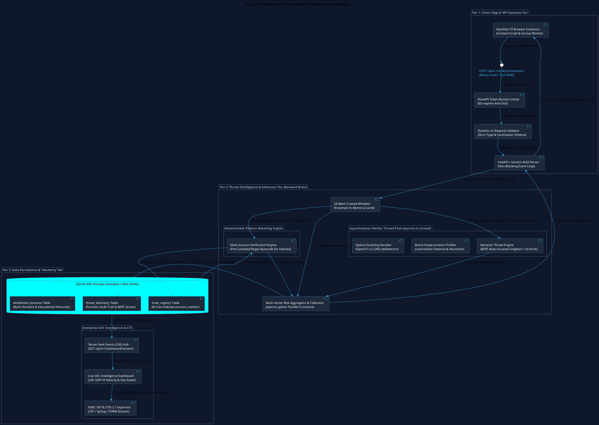
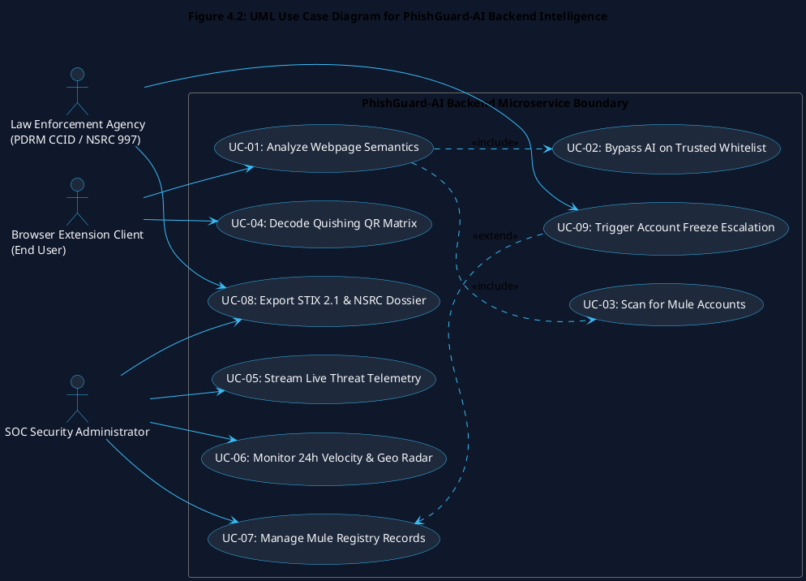
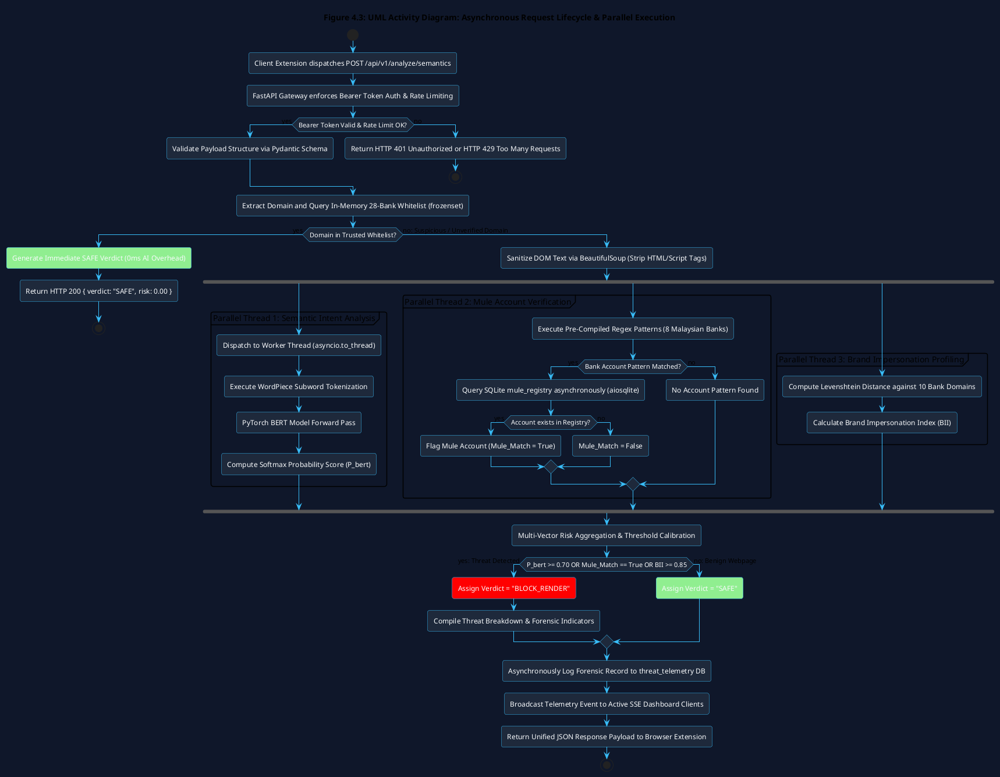
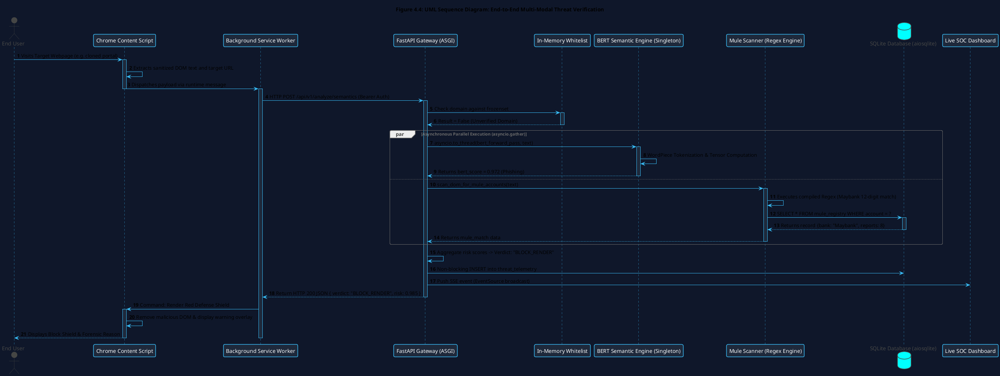
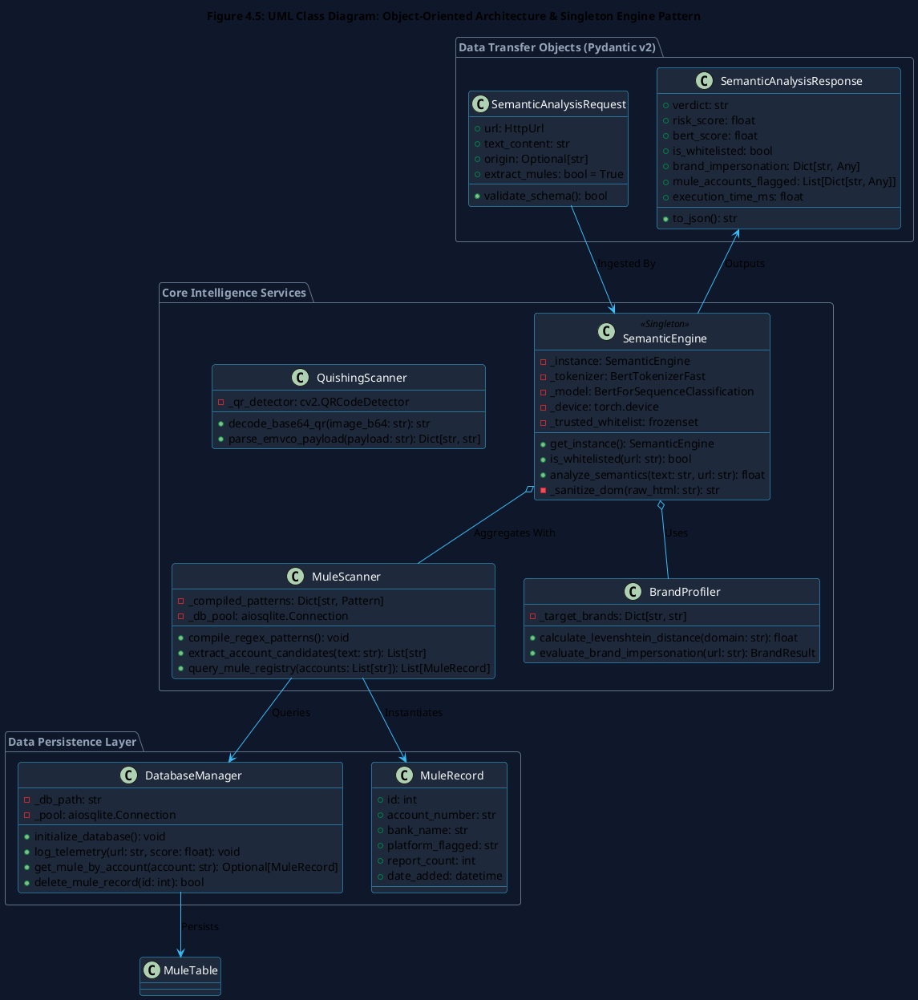
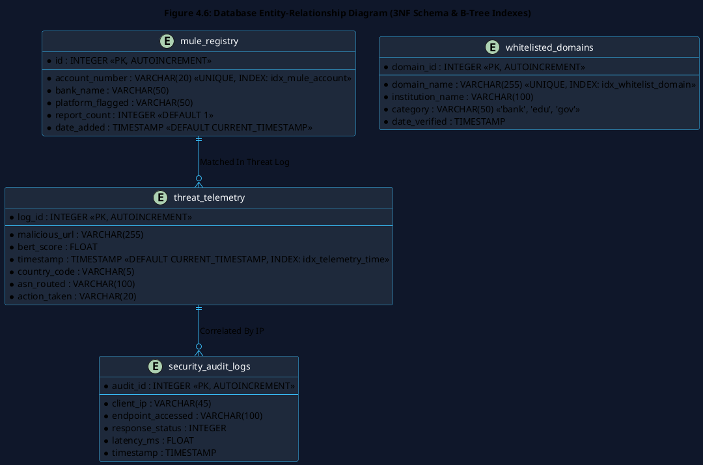
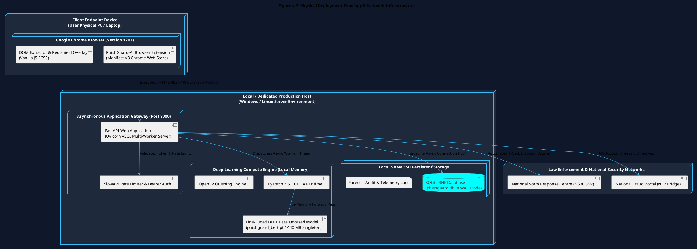

# Chapter 4: System Design

## 4.1 Introduction & Architectural Principles

The System Design phase represents the critical engineering bridge that translates the theoretical cybersecurity methodologies, non-functional constraints, and mathematical metrics formulated in Chapter 3 into concrete, executable technical blueprints. In enterprise-grade security engineering, deploying computationally intensive deep learning models alongside real-time web interceptors requires an architecture capable of guaranteeing sub-second response times, zero false alarms on legitimate banking portals, and complete data privacy.

This chapter details the comprehensive structural, behavioral, and persistence architecture of the **Semantic Threat Intelligence and Mule Account Verification Engine** developed as an individual module by Liew Yi Ler.

The architectural design of the backend is governed by five core foundational principles:
1. **Decoupled N-Tier Microservices Topology**: Isolates computationally heavy PyTorch tensor operations and database queries from the client-side Google Chrome extension, preventing client browser thread blocking (Newman, 2015).
2. **Zero Trust Edge Verification (ZTA)**: Enforces NIST SP 800-207 principles (*"Never Trust, Always Verify"*), evaluating raw DOM payloads independently of SSL/TLS certificates or domain age.
3. **Singleton In-Memory Model Management**: Employs the Singleton design pattern (Gamma et al., 1994) to load the 440 MB BERT Transformer model into system RAM strictly once during server initialization, eliminating run-time disk I/O latency.
4. **Asynchronous Non-Blocking Concurrency**: Leverages the Asynchronous Server Gateway Interface (ASGI), offloading CPU-bound operations via `asyncio.to_thread()` and executing database I/O concurrently using `asyncio.gather()`.
5. **Strict Defense-in-Depth Hardening**: Integrates Bearer token authentication, `SlowAPI` token-bucket rate limiting, Pydantic input sanitization, and parameterized SQL bindings to guarantee backend resilience.

---

## 4.2 High-Level System Architecture & N-Tier Decomposition

The PhishGuard-AI backend is architected as a decoupled, multi-tiered client-server system organized into three distinct logical tiers, visualised in Figure 4.1.



### 4.2.1 Tier 1: Client Edge & API Gateway Tier
The Application Gateway Tier operates as the asynchronous, hardened perimeter of the backend service. Deployed on **FastAPI** over the **Uvicorn** Asynchronous Server Gateway Interface (ASGI), it provides:
* **Cryptographic Request Authentication**: Enforces HTTP `Authorization: Bearer <API_KEY>` headers on all analysis routes.
* **Denial-of-Service Protection**: Implements `SlowAPI` token-bucket rate limiting (60 requests/minute per client IP) to prevent algorithmic exhaustion.
* **Payload Validation & Sanitization**: Uses `Pydantic v2` data transfer models to strictly validate data types, strip executable tags via `BeautifulSoup`, and catch malformed JSON payloads prior to downstream routing.

### 4.2.2 Tier 2: Threat Intelligence & Inference Tier (Backend Core)
The processing core executes multi-modal AI and deterministic fraud classification:
* **In-Memory 28-Bank Trusted Whitelist (`frozenset`)**: Evaluates incoming target domains against verified Malaysian financial institutions (`maybank2u.com.my`, `pbebank.com`, `cimbclicks.com.my`). Bypasses AI inference with $0\text{ ms}$ overhead for authentic portals, completely preventing false-positive disruptions.
* **Semantic NLP Engine (PyTorch BERT Singleton)**: Instantiates the fine-tuned `bert-base-uncased` Transformer model in local RAM. Offloaded to worker threads via `asyncio.to_thread()`, it executes WordPiece tokenization and multi-head attention forward passes to compute a semantic coercion score ($P_{\text{bert}} \in [0.0, 1.0]$).
* **Mule Account Verification Engine**: Executes pre-compiled Regular Expression (Regex) bytecode tailored to 8 Malaysian bank account formats, extracting numerical strings and querying the database without thread blocking.
* **Brand Impersonation Profiler**: Computes normalized **Levenshtein Distance** metrics against 10 domestic banking brands to identify typosquatting mutations (`rnaybank.com`).
* **Optical Quishing Decoder**: Utilizes OpenCV `cv2.QRCodeDetector()` to decode embedded EMVCo Merchant-Presented DuitNow QR codes from base64 images.

### 4.2.3 Tier 3: Data Persistence & Telemetry Tier
The persistence layer provides non-blocking relational storage and real-time security event broadcasting:
* **SQLite Database in WAL Mode**: Structured in **Third Normal Form (3NF)**, operating under Write-Ahead Logging (WAL) with B-Tree indexes on `account_number`, enabling sub-millisecond asynchronous queries (`aiosqlite`).
* **Server-Sent Events (SSE) Hub**: Broadcasts real-time threat telemetry events to active Security Operations Center (SOC) dashboard clients over persistent HTTP connections.
* **CTI & Law Enforcement Exporters**: Synthesizes threat records into standardized **OASIS STIX 2.1 JSON bundles**, ArcSight CEF logs, and 1-click **National Scam Response Centre (NSRC 997)** dispatch dossiers.

---

## 4.3 System Interfaces, API Contracts & OpenAPI Specifications

### 4.3.1 RESTful API Interface & OpenAPI Documentation
The backend strictly complies with the **Representational State Transfer (REST)** architectural model (Fielding, 2000). All communications are stateless, utilizing standard HTTP response codes and JSON serialized payloads (Crockford, 2006). 

FastAPI automatically generates interactive **OpenAPI 3.0 (Swagger UI)** documentation served at `/docs`, enabling standardized client-server integration testing.

```
+----------------------------------------------------------------------------------------------------+
|                         FASTAPI CORE RESTful API ROUTE REGISTRY                                    |
+----------------------------------------------------------------------------------------------------+
|   HTTP Method      Endpoint URI                       Function & Security Scope                    |
|  ─────────────    ───────────────────────────────    ────────────────────────────────────────────  |
|   POST            /api/v1/analyze/semantics          Real-Time Multi-Modal DOM & Mule Verification |
|   POST            /api/v1/analyze/quishing           Optical Base64 DuitNow QR Code Forensic Scan  |
|   GET             /api/v1/dashboard/stream           Server-Sent Events (SSE) Live Telemetry Stream|
|   GET             /api/v1/dashboard/distributions    24-Hour Threat Velocity Spectrum (GMT+8)      |
|   GET             /api/v1/dashboard/geo-threats      Geographic Attack Origin Nodes & ASNs         |
|   GET             /api/v1/dashboard/mules            Paginated Mule Registry Search & Filter       |
|   DELETE          /api/v1/dashboard/mules/{id}       Administrative Mule Record Revocation         |
|   POST            /api/v1/dashboard/export/stix      OASIS STIX 2.1 Threat Bundle JSON Exporter    |
|   POST            /api/v1/dashboard/escalate/nsrc    NSRC 997 & National Fraud Portal Case Freeze  |
+----------------------------------------------------------------------------------------------------+
```

### 4.3.2 Primary Endpoint Contract: `POST /api/v1/analyze/semantics`
This core endpoint orchestrates the real-time threat decision pipeline.

#### Request JSON Schema (`SemanticAnalysisRequest`):
```json
{
  "$schema": "http://json-schema.org/draft-07/schema#",
  "title": "SemanticAnalysisRequest",
  "type": "object",
  "required": ["url", "text_content"],
  "properties": {
    "url": {
      "type": "string",
      "format": "uri",
      "description": "The absolute target URL visited by the browser client."
    },
    "text_content": {
      "type": "string",
      "description": "Sanitized innerText extracted from the webpage DOM."
    },
    "origin": {
      "type": "string",
      "description": "Optional HTTP origin or referrer header."
    },
    "extract_mules": {
      "type": "boolean",
      "default": true,
      "description": "Flag to enable deterministic Regex mule account scanning."
    }
  }
}
```

#### Response JSON Schema (`SemanticAnalysisResponse`):
```json
{
  "$schema": "http://json-schema.org/draft-07/schema#",
  "title": "SemanticAnalysisResponse",
  "type": "object",
  "required": ["verdict", "risk_score", "bert_score", "is_whitelisted", "execution_time_ms"],
  "properties": {
    "verdict": {
      "type": "string",
      "enum": ["BLOCK_RENDER", "SAFE"],
      "description": "Final orchestration directive dispatched to browser extension."
    },
    "risk_score": {
      "type": "number",
      "minimum": 0.0,
      "maximum": 1.0,
      "description": "Calibrated multi-vector risk score."
    },
    "bert_score": {
      "type": "number",
      "minimum": 0.0,
      "maximum": 1.0,
      "description": "Raw semantic threat probability generated by BERT Transformer."
    },
    "is_whitelisted": {
      "type": "boolean",
      "description": "True if domain matched 28-Bank Trusted Whitelist."
    },
    "brand_impersonation": {
      "type": "object",
      "properties": {
        "is_impersonation": { "type": "boolean" },
        "targeted_brand": { "type": "string" },
        "similarity_index": { "type": "number" }
      }
    },
    "mule_accounts_flagged": {
      "type": "array",
      "items": {
        "type": "object",
        "properties": {
          "account_number": { "type": "string" },
          "bank_name": { "type": "string" },
          "report_count": { "type": "integer" },
          "platform_flagged": { "type": "string" }
        }
      }
    },
    "execution_time_ms": {
      "type": "number",
      "description": "Total server-side processing latency in milliseconds."
    }
  }
}
```

---

## 4.4 Unified Modeling Language (UML) Behavioral & Structural Models

To formally specify system interactions, execution flows, and object-oriented architectures, standard **Unified Modeling Language (UML 2.5)** diagrams are utilized (Fowler, 2003).

### 4.4.1 UML Use Case Diagram
The Use Case Diagram (Figure 4.2) models the functional boundaries of the backend system and specifies interactions with external actors:
* **Actor 1: Browser Extension Client (End User)**: Dispatches DOM payloads for real-time analysis and receives orchestration directives (`BLOCK_RENDER` vs. `SAFE`).
* **Actor 2: SOC Security Administrator**: Monitors live threat telemetry feeds, analyzes the 24-hour velocity timeline, manages mule registry entries, and triggers model retraining.
* **Actor 3: Law Enforcement (PDRM CCID / NSRC 997)**: Receives automated STIX 2.1 forensic dossiers and executes emergency account freezing directives.



### 4.4.2 UML Activity Diagram
The Activity Diagram (Figure 4.3) illustrates the algorithmic decision logic executed upon receiving an API inspection request, highlighting the parallel execution of the BERT NLP forward pass and the Regex database search via `asyncio.gather()`.



### 4.4.3 UML Sequence Diagram
The Sequence Diagram (Figure 4.4) chronologically maps the multi-threaded object interactions during a zero-day phishing interception event.



### 4.4.4 UML Class Diagram
The Class Diagram (Figure 4.5) details the Object-Oriented structure, encapsulation boundaries, and data transfer objects (DTOs) powering the Python backend.



---

## 4.5 Relational Database Design & Schema Normalization



### 4.5.1 Third Normal Form (3NF) & B-Tree Indexing Optimization
To eliminate data anomalies and guarantee sub-millisecond lookup times, the relational database schema is normalized to the **Third Normal Form (3NF)** (Elmasri & Navathe, 2015):
1. **1NF Compliance**: All attribute domains contain strictly atomic, scalar values; repeating groups and nested arrays are decomposed.
2. **2NF Compliance**: All non-key attributes are fully functionally dependent on the primary key, eliminating partial key dependencies.
3. **3NF Compliance**: No non-key attribute is transitively dependent on the primary key ($X \rightarrow Y$ transitive dependencies eliminated).

#### B-Tree Indexing Algorithmic Acceleration
In high-concurrency web defense, executing a full-table sequential scan ($O(N)$) across thousands of scam records introduces unacceptable latency. By applying **B-Tree Indexing** to the `account_number` column in the `mule_registry` table:

$$\text{Search Time Complexity: } \mathcal{O}(\log_B N) \ll \mathcal{O}(N)$$

Where $B$ represents the branching factor of the B-Tree page. Lookups execute in $< 0.5\text{ milliseconds}$, maintaining the sub-400ms end-to-end SLA.

---

### 4.5.2 Data Dictionaries

**Table 4.1: Data Dictionary for `mule_registry` Entity**

| Column Name | SQL Data Type | Key / Constraint | Description & Purpose |
| :--- | :--- | :--- | :--- |
| `id` | `INTEGER` | `PRIMARY KEY AUTOINCREMENT` | Unique surrogate key identifying each fraudulent account record. |
| `account_number` | `VARCHAR(20)` | `NOT NULL UNIQUE INDEX(idx_mule_account)` | The exact bank account or e-wallet identifier flagged for fraud. |
| `bank_name` | `VARCHAR(50)` | `NOT NULL` | The issuing financial institution (e.g., Maybank, CIMB, Public Bank). |
| `platform_flagged`| `VARCHAR(50)` | `NOT NULL DEFAULT 'manual'` | The scam platform where the account was reported (e.g., Telegram, FB). |
| `report_count` | `INTEGER` | `NOT NULL DEFAULT 1` | Cumulative number of verified victim reports lodged against this mule. |
| `date_added` | `TIMESTAMP` | `DEFAULT CURRENT_TIMESTAMP` | The chronological timestamp when the record was registered (ISO 8601). |

**Table 4.2: Data Dictionary for `threat_telemetry` Entity**

| Column Name | SQL Data Type | Key / Constraint | Description & Purpose |
| :--- | :--- | :--- | :--- |
| `log_id` | `INTEGER` | `PRIMARY KEY AUTOINCREMENT` | Unique audit record identifier for the intercepted threat event. |
| `malicious_url` | `VARCHAR(255)` | `NOT NULL` | The complete URL string evaluated by the multi-modal pipeline. |
| `bert_score` | `FLOAT` | `NOT NULL` | The semantic phishing confidence probability generated by BERT. |
| `timestamp` | `TIMESTAMP` | `DEFAULT CURRENT_TIMESTAMP INDEX(idx_telemetry_time)` | Interception timestamp synchronized to Malaysia Standard Time (GMT+8). |
| `country_code` | `VARCHAR(5)` | `NOT NULL DEFAULT 'MY'` | ISO 3166-1 alpha-2 country code of the attack infrastructure origin. |
| `asn_routed` | `VARCHAR(100)` | `NOT NULL` | Autonomous System Number and network provider (e.g., TM Net AS4788). |
| `action_taken` | `VARCHAR(20)` | `NOT NULL DEFAULT 'BLOCKED'` | The defensive action executed (`BLOCKED`, `FLAGGED`, `WHITELISTED`). |

**Table 4.3: Data Dictionary for `whitelisted_domains` Entity**

| Column Name | SQL Data Type | Key / Constraint | Description & Purpose |
| :--- | :--- | :--- | :--- |
| `domain_id` | `INTEGER` | `PRIMARY KEY AUTOINCREMENT` | Unique identifier for the trusted domain record. |
| `domain_name` | `VARCHAR(255)` | `NOT NULL UNIQUE INDEX(idx_whitelist_domain)` | Normalized root domain of the verified financial/educational portal. |
| `institution_name`| `VARCHAR(100)` | `NOT NULL` | Official organization name (e.g., Malayan Banking Berhad). |
| `category` | `VARCHAR(50)` | `NOT NULL` | Classification scope (`'bank'`, `'edu'`, `'gov'`). |
| `date_verified` | `TIMESTAMP` | `DEFAULT CURRENT_TIMESTAMP` | Date when the domain was cryptographically and administratively vetted. |

---

## 4.6 Mule Account Regex Pattern Matching & Extraction Architecture

To guarantee zero false positives on generic numbers (e.g., order tracking numbers, phone numbers, postal codes), the Mule Account Scanner compiles bank-specific **Deterministic Finite State Automata (DFA)** using Python's `re.compile()` module.

```
+----------------------------------------------------------------------------------------------------+
|                         C-LEVEL PRE-COMPILED REGEX BYTECODE PIPELINE                               |
+----------------------------------------------------------------------------------------------------+
|                                                                                                    |
|  [Raw Sanitized DOM Text Ingestion]                                                                |
|         │                                                                                          |
|         ▼                                                                                          |
|  [Iterate Pre-Compiled Bytecode Dictionary (8 Major Malaysian Banks)]                              |
|   1. Maybank     ──> `\b(1[0-9]{11}|5[0-9]{11})\b`   ──> Matches 12 digits (Prefix 1 or 5)         |
|   2. CIMB Bank   ──> `\b(7[0-9]{9}|8[0-9]{9}|[0-9]{14})\b` ──> Matches 10 or 14 digits            |
|   3. Public Bank ──> `\b(3[0-9]{9}|4[0-9]{9}|6[0-9]{9})\b` ──> Matches 10 digits                  |
|   4. RHB Bank    ──> `\b(1[0-9]{9}|2[0-9]{9}|[0-9]{14})\b` ──> Matches 10 or 14 digits            |
|   5. Hong Leong  ──> `\b(0[0-9]{10}|1[0-9]{10}|3[0-9]{10})\b` ──> Matches 11 digits              |
|   6. AmBank      ──> `\b(0[0-9]{12}|2[0-9]{12}|8[0-9]{12})\b` ──> Matches 13 digits              |
|   7. Bank Islam  ──> `\b(12[0-9]{12}|14[0-9]{12})\b` ──> Matches 14 digits                        |
|   8. Bank Rakyat ──> `\b(11[0-9]{10}|22[0-9]{10})\b` ──> Matches 12 digits                        |
|         │                                                                                          |
|         ▼                                                                                          |
|  [Candidate Deduplication & Format Tagging]                                                        |
|         │                                                                                          |
|         ▼                                                                                          |
|  [Asynchronous SQLite B-Tree Query: `SELECT * FROM mule_registry WHERE account_number IN (...)`]    |
+----------------------------------------------------------------------------------------------------+
```

**Table 4.4: Bank-Specific Regular Expression Bytecode Specifications**

| Financial Institution | Exact Account Format | Pre-Compiled Regex Pattern | Example Test Payload |
| :--- | :--- | :--- | :--- |
| **Maybank** | 12 digits, starts with 1 or 5 | `\b(1[0-9]{11}\|5[0-9]{11})\b` | `514012345678` |
| **CIMB Bank** | 10 or 14 digits, starts with 7 or 8 | `\b(7[0-9]{9}\|8[0-9]{9}\|[0-9]{14})\b` | `7012345678` |
| **Public Bank** | 10 digits, starts with 3, 4, or 6 | `\b(3[0-9]{9}\|4[0-9]{9}\|6[0-9]{9})\b` | `3123456789` |
| **RHB Bank** | 10 or 14 digits, starts with 1 or 2 | `\b(1[0-9]{9}\|2[0-9]{9}\|[0-9]{14})\b` | `21234567890123` |
| **Hong Leong Bank** | 11 digits, starts with 0, 1, or 3 | `\b(0[0-9]{10}\|1[0-9]{10}\|3[0-9]{10})\b` | `01234567890` |
| **AmBank** | 13 digits, starts with 0, 2, or 8 | `\b(0[0-9]{12}\|2[0-9]{12}\|8[0-9]{12})\b` | `8123456789012` |
| **Bank Islam** | 14 digits, starts with 12 or 14 | `\b(12[0-9]{12}\|14[0-9]{12})\b` | `14012345678901` |
| **Bank Rakyat** | 12 digits, starts with 11 or 22 | `\b(11[0-9]{10}\|22[0-9]{10})\b` | `110123456789` |
| **Generic Fallback** | 10 to 14 continuous digits | `\b[0-9]{10,14}\b` | Unlisted Institution |

---

## 4.7 Security Hardening, Defense-in-Depth & Error Handling

```
+----------------------------------------------------------------------------------------------------+
|                         DEFENSE-IN-DEPTH SECURITY HARDENING ARCHITECTURE                           |
+----------------------------------------------------------------------------------------------------+
|                                                                                                    |
|  [Layer 1: Network Ingestion]   ──> Token-Bucket Rate Limiting (SlowAPI: 60 req/min per IP)        |
|  [Layer 2: Authentication]      ──> Cryptographic HTTP Authorization: Bearer <256-bit Token>       |
|  [Layer 3: Input Sanitization]  ──> Pydantic v2 Type Constraints + BeautifulSoup HTML Stripping    |
|  [Layer 4: SQL Injection Block] ──> Strictly Parameterized `aiosqlite` SQL Binding Placeholders (`?`)|
|  [Layer 5: Exception Shield]    ──> Global Async Handlers: HTTP 422 (Schema), HTTP 500 (Fail-Safe)|
|                                                                                                    |
+----------------------------------------------------------------------------------------------------+
```

1. **Cryptographic Authentication**: Access to threat analysis endpoints requires valid 256-bit API keys passed via `Authorization: Bearer <token>`. Unauthenticated probing is immediately dropped with HTTP 401 Unauthorized.
2. **Denial-of-Service (DoS) Mitigation**: The `SlowAPI` token-bucket limiter bounds request volume to 60 requests/minute per client IP. Excess traffic is rejected with HTTP 429 Too Many Requests, protecting worker thread pools from exhaustion.
3. **SQL Injection Neutralization**: All database interactions use strictly parameterized SQL queries (`SELECT * FROM mule_registry WHERE account_number = ?`), completely eliminating SQL injection risks.
4. **Resilient Exception Handling**:
   * **HTTP 422 Unprocessable Entity**: Automatically returned if the client submits malformed JSON schemas.
   * **HTTP 500 Internal Error Fail-Safe**: If a PyTorch CUDA memory fault occurs, global exception handlers log the error and return a safe fallback decision, ensuring client browser stability.

---

## 4.8 Physical Deployment Architecture & Network Topology



The physical infrastructure (Figure 4.7) maps the execution environments across client and server boundaries:
* **Client Host**: Executes the Manifest V3 Google Chrome Extension, performing local DOM extraction and displaying the high-impact red defense shield upon receiving a `BLOCK_RENDER` verdict.
* **Server Host (Dedicated Local/Edge Infrastructure)**: Hosts the FastAPI/Uvicorn ASGI service on Port 8000. It manages PyTorch CUDA runtimes in dedicated memory spaces, hosts the SQLite WAL database on high-speed NVMe storage, and provides upstream telemetry integration to the **National Scam Response Centre (NSRC 997)** and **National Fraud Portal (NFP)**.

---

## 4.9 Chapter Summary

This chapter has detailed the structural blueprints, behavioral execution models, and data persistence architectures governing the **PhishGuard-AI** backend intelligence engine.

Key architectural specifications established in this chapter include:
1. **N-Tier Microservice Topology**: Decoupled the architecture into API Gateway, Threat Inference, and Data Persistence tiers to guarantee zero browser blocking.
2. **RESTful API Contracts**: Specified the exact request/response JSON schemas for `POST /api/v1/analyze/semantics` and `POST /api/v1/analyze/quishing`.
3. **Formal UML Behavioral Models**: Constructed Use Case, Activity, Sequence, and Class diagrams mapping the asynchronous multi-threaded lifecycle.
4. **Relational Database Design**: Formulated a 3NF-compliant SQLite schema with B-Tree indexing ($O(\log N)$) and comprehensive data dictionaries.
5. **Deterministic Regex Engine**: Compiled 8 bank-specific C-level regex automata to achieve microsecond financial credential extraction.
6. **Defense-in-Depth & Deployment**: Hardened the API perimeter with Bearer authentication, token-bucket rate limiting, and mapped physical host topologies.

These technical specifications form the direct implementation blueprint for **Chapter 5: Implementation and Testing**, which documents the source code implementation, test suites, and empirical verification results.
